# Kirana end to end: order → payment → reconciliation → refund → fulfilment

How every business operation works after Stage 7: each transaction, each network call, each
table, what is idempotent, and what happens when any step fails. One diagram per operation.

**How to read the diagrams**

* Shaded boxes labelled **TX-n** are database transactions: everything inside commits together
  or not at all. Anything outside a TX box is not in a transaction.
* `⇢ net` marks a network call to another system (Redis, Kafka, payment gateway, warehouse).
* 🔑 marks an idempotency guard (why doing it twice is harmless).
* Numbers (autonumber) are the step numbers used in the tables under each diagram.

---

## 0. The map: who talks to whom

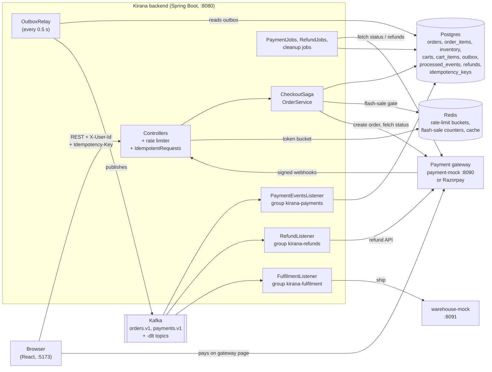

| Topic | Events (key = our order id) | Consumed by |
|---|---|---|
| `orders.v1` | `OrderPlaced`, `OrderPaid`, `OrderClosed`, `PaymentAfterClose` | `kirana-refunds` (acts on `PaymentAfterClose`), `kirana-fulfilment` (acts on `OrderPaid`) |
| `payments.v1` | `PaymentCaptured`, `PaymentFailed`, `RefundProcessed`, `RefundFailed` (from webhooks) | `kirana-payments` |
| `orders.v1-dlt`, `payments.v1-dlt` | records a consumer gave up on | re-drive (lab button), group `kirana-dlt-redrive` |

---

## 1. The state machines

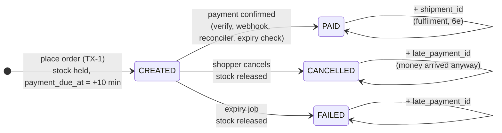

Every arrow out of `CREATED` is **one conditional UPDATE** (`… WHERE status = 'CREATED'`). Whoever
gets "1 row updated" owns the transition and its side effects (stock release, events); everyone
else gets 0 and does nothing. 🔑 This is what lets the browser, the webhook, the reconciler and
the expiry job race safely.

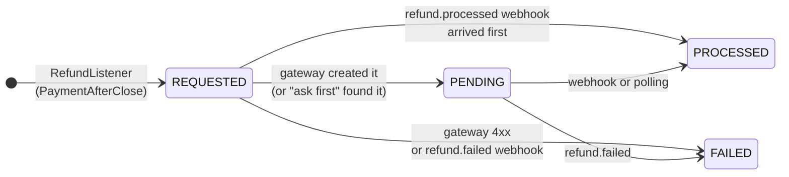

---

## 2. Place order (cart → order with stock held → payment window opens)

`POST /orders`, headers `X-User-Id`, `Idempotency-Key`, body `{"paymentProvider":"mock"}`.

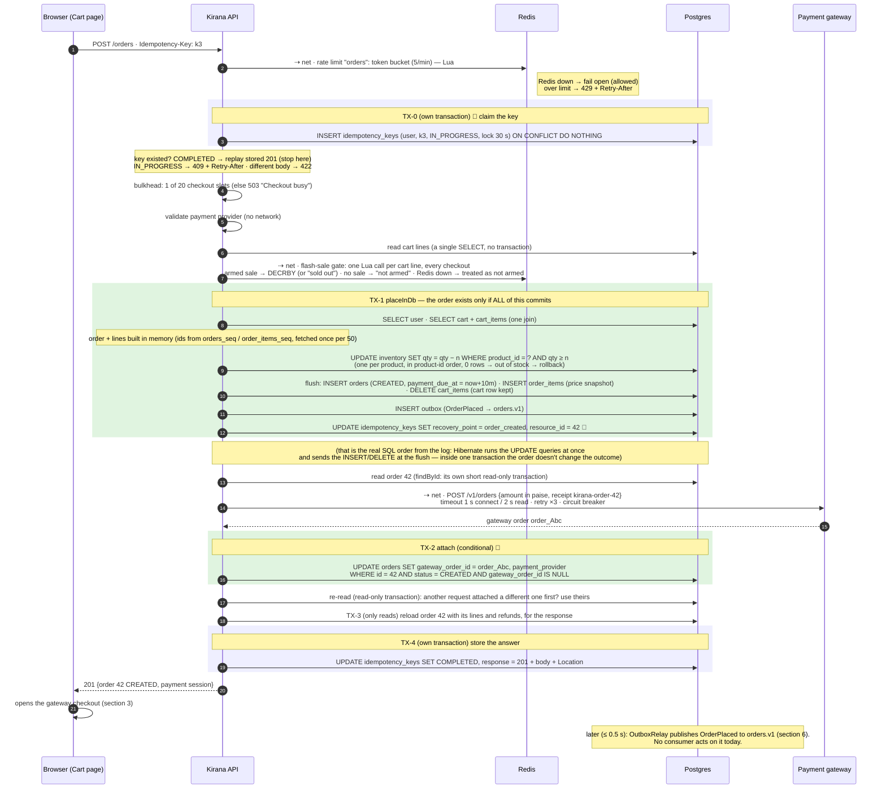

### Transactions in this flow

| TX | What commits together | Tables written | Why separate |
|---|---|---|---|
| TX-0 | claim the idempotency key | `idempotency_keys` | must be visible to a concurrent duplicate **before** the work starts |
| **TX-1** | order + order lines + stock decrement + cart emptied + `OrderPlaced` event + recovery point | `orders`, `order_items`, `inventory`, `cart_items`, `outbox`, `idempotency_keys` | the business change: all or nothing |
| TX-2 | gateway order id attached | `orders` | a network call (gateway) sits between TX-1 and TX-2; never hold a transaction open across it |
| TX-3 | reload for the response (reads only) | — | |
| TX-4 | the response stored with the key | `idempotency_keys` | |

So: **2 business write transactions** (TX-1, TX-2) and **2 idempotency transactions** (TX-0, TX-4).
Counting everything, the request opens **7 short transactions** (those 4, plus 3 that only read:
two `findById` and TX-3) and runs one SELECT outside any transaction (the cart lines). Measured
in a test with SQL logging: **19 SQL statements** for one place-order request (including 3
sequence fetches, which normally happen once per 50 rows). Network: 1 Redis call for the rate
limit, 1 per cart line for the flash-sale gate, 1 gateway call (up to 3 attempts).

### What if a step fails

| Step fails | What the shopper gets | What's left behind | Why it's safe |
|---|---|---|---|
| 2 rate limit | 429 + `Retry-After` | nothing | before any work (a replay also spends a token: the limiter runs before the key is checked) |
| 3 key claim: key COMPLETED | the stored 201 (same order) | nothing new | 🔑 replay |
| 3 key claim: key IN_PROGRESS | 409 "Request in progress" + `Retry-After: 1` | nothing | the first attempt is still running |
| 4 bulkhead full | 503 "Checkout busy" | key deleted | nothing happened, retry runs fresh |
| 5 unknown or unavailable payment provider | 400 (`paymentProvider`) | key deleted | checked before any stock is taken |
| 7 flash sale sold out | 409 "Out of stock" | key deleted | gate refused before any transaction |
| TX-1: cart empty | 409 "Cart is empty" | key deleted (no gate units were taken: no lines) | rolled back |
| TX-1: out of stock (step 10 updates 0 rows) | 409 "Out of stock" | whole TX-1 rolled back (earlier lines' stock restored), gate units given back, key deleted | one transaction |
| TX-1: two tabs checking out the same cart | 409 "Checkout already in progress" | the second rolled back (its cart-line DELETE found 0 rows) | optimistic check |
| TX-1: database down | 503 "Database busy" | nothing | |
| **after TX-1, gateway timeout / 5xx / breaker open** (step 15) | **201** with `payment: null`, `paymentProblem: "…try paying again from Orders"` | order CREATED, stock held until `payment_due_at`; key COMPLETED with this response | the order is kept; **Pay now** (section 4) later; expiry releases stock if never paid |
| after TX-1, gateway 4xx | 502 "Payment gateway error" | order CREATED; key kept **with recovery point**, unlocked | a retry with k3 resumes: skips TX-1, retries the gateway |
| **process crashes after TX-1** | (no answer: client times out) | order CREATED; key IN_PROGRESS + `order_created, 42` | 🔑 the client retries with k3; after the 30 s lock the retry **resumes** from the recovery point: no second order |
| crash after the gateway call, before TX-2 | (no answer) | an unused gateway order at the gateway | harmless; the resume creates/attaches one, the orphan expires unpaid |
| TX-4 fails | error, although the order exists | key IN_PROGRESS with recovery point | same resume as above |
| an attempt timed out but the gateway had created its order; the retry created another (Razorpay doesn't de-duplicate receipts, D55) | normal | an orphan gateway order | we only learn, attach and show the id from the attempt that answered; the orphan is never shown to the browser, so it can't be paid, and expires |

**Idempotency in this flow:** the client key (TX-0/TX-4 + recovery point in TX-1); the conditional
attach in TX-2; one gateway order per Kirana order, reused forever after (D55).

---

## 3. Payment: two ways the "paid" news arrives

The shopper pays **on the gateway's page** (payment-mock's page in an iframe, or Razorpay's
checkout.js). Card data never touches Kirana. Then the news reaches Kirana twice: from the
browser (fast, can be lost) and from the gateway's webhook (reliable, retried). Either one
finishing first is fine.

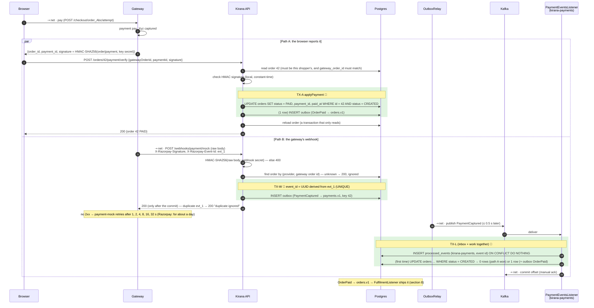

### `applyPayment`: the one method every path ends in

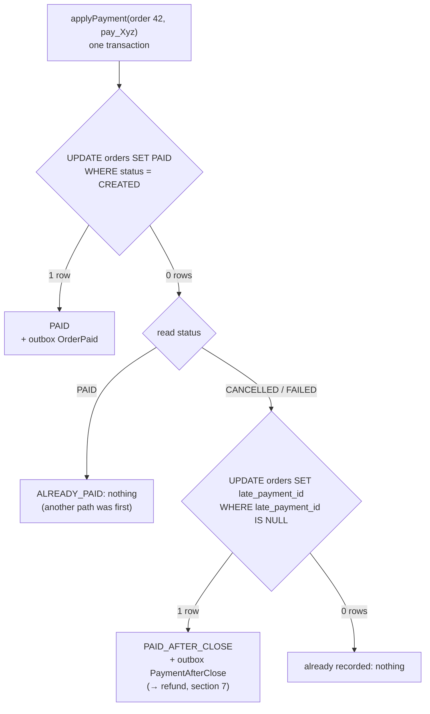

Called by: verify (path A; a late payment answers **409 "Order already closed … A refund is needed"**), the webhook consumer
(path B; never throws), the reconciler and expiry (section 5), the re-check job.

### What if a step fails

| Fails | Result | Why it's safe |
|---|---|---|
| browser closed after paying (path A never happens) | path B marks it PAID in ~0.5 s | webhook |
| forged signature on verify | 400 | HMAC with a secret the browser doesn't have |
| verify for an order that closed meanwhile | 409 "Order already closed"; `late_payment_id` set; `PaymentAfterClose` | section 7 refunds it |
| verify for someone else's order, or a gateway order id that isn't this order's | 404 / 400 | checked before the signature |
| webhook bad signature | 400; gateway keeps retrying | anyone can POST to a public URL |
| webhook while Kirana is down | gateway retries; delivered after restart | at-least-once from the gateway |
| webhook delivered twice | second insert hits `outbox.event_id UNIQUE` → 200 "duplicate ignored" | 🔑 |
| Kafka down | event waits in `outbox`; checkout unaffected | outbox (section 6) |
| consumer crashes after TX-L, before the offset commit | redelivered; `processed_events` says seen → skipped | 🔑 inbox |
| consumer throws (DB hiccup) | retried 3× 1 s apart, then → `payments.v1-dlt` | dead letter, not dropped |
| unknown event type | straight to `payments.v1-dlt` (TX rolled back) | never "acknowledged as done" |
| webhooks never arrive at all (Razorpay without a tunnel) | reconciler finds it: orders older than 1 min for a gateway without webhooks, 10 min for one with them; it runs every 30 s | section 5 |

---

## 4. Pay now (retry payment) and Cancel

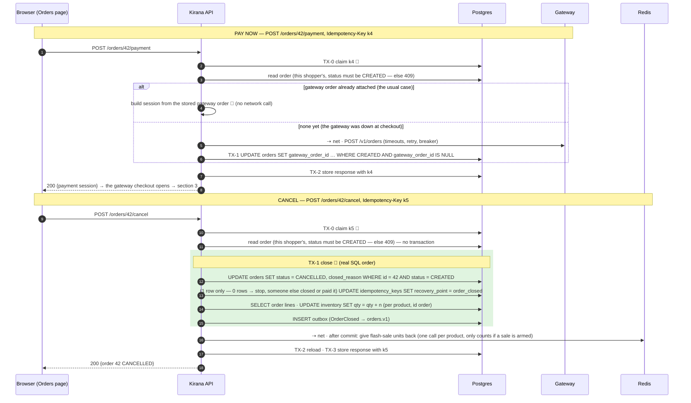

| Fails | Result |
|---|---|
| retry of cancel with k5 (first answer lost) | stored 200 replayed (not 409) 🔑 |
| crash after TX-1, before storing | retry resumes after `order_closed`: answers with the order, releases nothing twice 🔑 |
| cancel races the expiry job or a payment | conditional UPDATE: one wins; stock released once |
| shopper had paid in another tab, cancel won the race | the payment becomes a late payment → refund (section 7) |
| Redis down at step "give back" | skipped (flash-sale counter only; Postgres stock is already right) |

---

## 5. Background settlement: reconciler, expiry, re-check

Three `@Scheduled` jobs (`PaymentJobs`) that ask the gateway for the truth (polling), the safety
net for everything the browser and webhooks might miss. Each order is settled in its own
transaction; a gateway outage just leaves orders for the next run.

```mermaid
flowchart TD
    subgraph REC["Reconciler — every 30 s"]
        R1["SELECT CREATED orders with a gateway order,<br/>older than 10 min (1 min if the gateway sends no webhooks)<br/>batch 50"] --> R2["⇢ net GET /v1/orders/{id}/payments<br/>(retry, breaker)"]
        R2 -->|"captured"| R3["applyPayment → PAID<br/>(TX: UPDATE orders + outbox OrderPaid)"]
        R2 -->|"nothing captured"| R4["leave it"]
        R2 -->|"gateway down"| R5["WARN, next run"]
    end
    subgraph EXP["Expiry — every 30 s"]
        E1["SELECT CREATED orders with payment_due_at < now<br/>oldest first, batch 50"] --> E2{"gateway order?"}
        E2 -->|no| EC
        E2 -->|yes| E3["⇢ net fetch status"]
        E3 -->|PAID| E4["applyPayment → PAID"]
        E3 -->|"PENDING<br/>(known, nothing captured)"| EC["TX close: UPDATE orders SET FAILED WHERE CREATED<br/>+ inventory += qty + outbox OrderClosed<br/>(after commit: flash-sale units back)"]
        E3 -->|"UNKNOWN (no record)"| E5{"created + 10 min + 1 h passed?"}
        E5 -->|no| E6["TX: UPDATE orders SET payment_due_at += 5 min<br/>(stock stays held; back of the queue)"]
        E5 -->|yes| E7["ERROR log, then close FAILED"] --> EC
        E3 -->|"gateway down"| E8["WARN, next run"]
    end
    subgraph RCK["Re-check closed — every 2 min"]
        C1["SELECT CANCELLED/FAILED orders, gateway order set,<br/>no late payment, updated_at in the last 30 min<br/>(≈ closed in the last 30 min)"] --> C2["⇢ net fetch status"]
        C2 -->|"captured"| C3["applyPayment → late payment<br/>(TX: late_payment_id + outbox PaymentAfterClose)"]
        C2 -->|"nothing"| C4["leave it"]
    end
```

| Job | Finds | Covers the case where… |
|---|---|---|
| Reconciler | unpaid orders that might be paid | browser closed **and** webhook lost |
| Expiry | unpaid orders past the window | the shopper walked away: releases the stock (only a timer can notice "nothing happened") |
| Re-check | closed orders that might have been paid | money captured **after** the order closed, webhook lost (G1) |

All three are correct even if two instances run them at once (conditional UPDATEs), but the work
and gateway calls are duplicated: that's Stage 8's problem.

---

## 6. The event pipe: outbox → relay → Kafka → consumers

Every event in sections 2–8 travels this way.

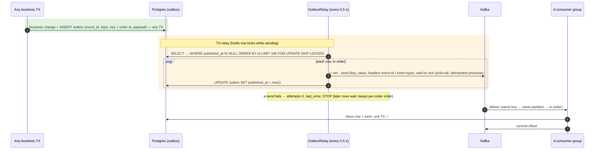

| Guarantee | How |
|---|---|
| no event without its change, no change without its event | same transaction (outbox) |
| delivered even if Kafka or the app was down | the row waits; relay retries every 0.5 s |
| two app instances don't send the same row at once | `FOR UPDATE SKIP LOCKED` |
| one order's events in order | key = order id → one partition; relay stops at the first failure. **Only with one relay running.** With two instances, relay A can lock rows 1–100 while relay B skips them and publishes row 120, which may be a later event of an order whose earlier event is row 99. Fix: one relay at a time (a lock or leader, Stage 8) or split the outbox by key |
| duplicates (relay crash after send, before marking) | possible (at-least-once) → every consumer de-duplicates 🔑 |
| consumer failure | retry, then dead-letter topic; re-drive from the lab |
| a crashed consumer's partitions | moved to another instance after the 10 s session timeout |
| tables don't grow forever | hourly: delete published outbox rows and processed_events older than 7 days |

---

## 7. Late payment → refund (end to end)

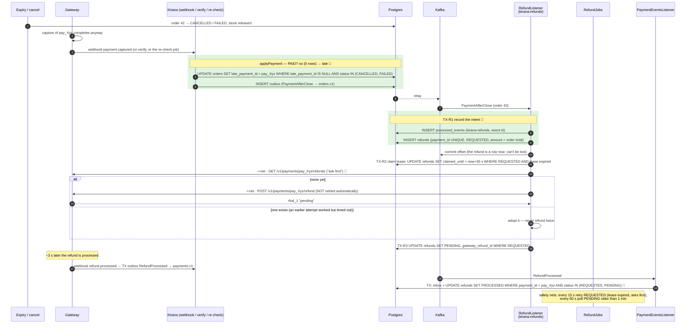

| Fails | Result | Why it's safe |
|---|---|---|
| `PaymentAfterClose` delivered twice | inbox skips; `payment_id UNIQUE` | 🔑 |
| consumer and job try at the same moment | only the lease holder calls the gateway | 🔑 lease |
| refund call times out **after** the gateway refunded | stays REQUESTED; next attempt asks first, finds rfnd_1, adopts it | 🔑 ask first — measured: 1 refund |
| gateway down | REQUESTED + `last_error`; job retries after the 30 s lease | the offset was already committed: the partition isn't blocked |
| gateway 4xx (e.g. forgot the payment) | FAILED, ERROR log: a person must look | retrying can't help |
| refund webhook lost | `pollPending` settles it | polling |
| refund webhook arrives before we stored rfnd_1 | settled by payment id | `coalesce` keeps the id |

Shopper sees: **Refund requested → Refund in progress → Refunded** on the Orders page.

---

## 8. Fulfilment: paid order → warehouse

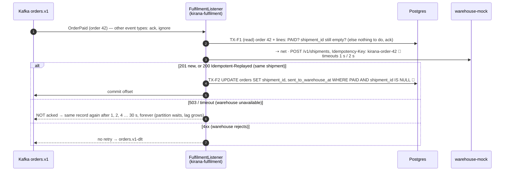

Why this consumer **blocks and retries** while the refund consumer **records and moves on**: the
warehouse call is idempotent (safe to repeat), and an outage fails every `OrderPaid` alike, so
skipping ahead wouldn't ship anything else. The refund call is not idempotent and failures are
per refund. (Old naive version, kept behind `FULFILMENT_MODE=naive`: call the warehouse right
after the PAID commit, in the shopper's request: slow, lost on failure, and can disagree.)

---

## 9. Cheat sheets

### Every transaction, by operation

| Operation | Write transactions | Network calls |
|---|---|---|
| Add to cart | key claim · TX (cart create-if-absent + insert-or-increment + recovery point) · key store | Redis rate limit |
| Place order | key claim · **TX-1** (order, lines, stock, cart, outbox, recovery point) · **TX-2** (attach gateway order) · key store (+ 3 read-only) | Redis rate limit, Redis flash gate (1 per cart line), gateway create order |
| Verify payment | **TX** applyPayment (order PAID + outbox), then a reload | none (HMAC is local) |
| Webhook | **TX** outbox insert | none in the request |
| Pay now | key claim · (TX attach, only if none) · key store | gateway, only if no gateway order yet |
| Cancel | key claim · **TX** (close, stock back, outbox, recovery point) · key store | Redis give-back after commit |
| Reconcile / expiry / re-check (per order) | one TX for whatever it settles | gateway fetch status |
| Relay batch | one TX holding the rows while sending | Kafka send per row |
| Payment consumer (per event) | one TX: inbox + applyPayment / refund settle | Kafka offset commit |
| Refund consumer | TX intent (inbox + refund row) · TX lease · TX result | gateway list refunds, create refund |
| Fulfilment consumer | TX read · TX shipment id | warehouse create shipment |

### Every table, and who writes it

| Table | Written by |
|---|---|
| `carts`, `cart_items` | add/update/remove cart; place order deletes the lines |
| `orders` | place (insert), attach, verify / webhook consumer / jobs (PAID), cancel / expiry (closed), late payment, shipment, expiry postpone |
| `order_items` | place (price snapshot) |
| `inventory` | place (−), cancel / expiry (+), admin |
| `outbox` | every event (same TX as the change); relay marks published; cleanup |
| `processed_events` | each consumer's inbox; cleanup |
| `refunds` | refund consumer, refund jobs, refund webhooks |
| `idempotency_keys` | the 4 keyed endpoints; recovery points inside their TXs; cleanup |

### Background work

| What | Every | Does |
|---|---|---|
| OutboxRelay | 0.5 s | outbox → Kafka |
| Reconciler | 30 s | CREATED + gateway order, older than 10 min (1 min without webhooks) → PAID? |
| Expiry | 30 s | past due → PAID? else FAILED + stock back (UNKNOWN: hold up to 1 h) |
| Re-check closed | 2 min | closed < 30 min ago → paid after all? → late payment |
| Refund retry | 15 s | REQUESTED, lease expired → ask first, then refund |
| Refund poll | 60 s | PENDING > 1 min → processed? |
| Messaging cleanup | 1 h | published outbox + processed_events > 7 days |
| Idempotency cleanup | 1 h | keys > 24 h |

### Idempotency, everywhere

| Repeat comes from | Stopped by |
|---|---|
| client retry | `Idempotency-Key` + recovery points |
| browser + webhook + jobs all reporting one payment | conditional UPDATE `WHERE status = 'CREATED'` |
| "Pay now" again | the stored gateway order is reused (D55) |
| gateway webhook retry | outbox `event_id` derived from the gateway's event id (UNIQUE) |
| producer network retry | Kafka idempotent producer |
| Kafka redelivery | `processed_events` |
| refund retry | `payment_id UNIQUE` + lease + ask first |
| warehouse retry | warehouse `Idempotency-Key: kirana-order-{id}` + `WHERE shipment_id IS NULL` |

---

## 10. Interview answers

**"What exactly happens when I click Place order?"**
> The browser sends `POST /orders` with an `Idempotency-Key`. After the Redis rate limit, the key
> is claimed in its own small transaction so a concurrent duplicate sees it. The flash-sale gate
> asks Redis for each cart line (only products with an armed sale are limited there). Then **one
> transaction** decrements stock with a conditional `UPDATE … WHERE qty ≥ n` per product in id
> order (sorted to avoid deadlocks), inserts the order and its lines, empties the cart, writes an
> `OrderPlaced` row to the outbox, and marks the key "order_created, 42". Only
> after that commits do we call the gateway (outside any transaction, with timeouts, retries and
> a circuit breaker) to create its order, and a **second transaction** attaches the gateway order
> id with a conditional update. The response is stored with the key and returned: 201 with the
> payment session. The outbox relay publishes `OrderPlaced` to Kafka within half a second.

**"How many transactions?"**
> Two business transactions: place (order + stock + cart + event, all or nothing) and attach.
> Plus two small ones for the idempotency key, and three that only read; about 19 SQL statements
> in all. Place and attach are separate because a network call sits between them, and you never
> hold a database transaction across a network call.

**"What if the payment gateway is down?"**
> The order is already committed with stock held, so we return 201 with "payment temporarily
> unavailable, pay from Orders". The breaker opens after repeated failures so later checkouts
> fail fast instead of waiting. The shopper uses Pay now later; if they never pay, the expiry job
> releases the stock after 10 minutes, but only after asking the gateway one last time.

**"What if the app crashes right after the order transaction?"**
> The order and the key's recovery point committed together. The client retries with the same
> key; once the 30-second lock expires, the retry sees "order_created, 42" and resumes from
> there: no second order, no second stock decrement.

**"The shopper paid but closed the tab. How do you know?"**
> The gateway's signed webhook. We verify the HMAC over the raw body, store it in the outbox in
> one transaction, answer 200, and a Kafka consumer marks the order paid with a conditional
> update, de-duplicating by event id. If the webhook never comes, the reconciler polls the
> gateway for unpaid orders older than 10 minutes (1 minute for a gateway that can't send us
> webhooks).

**"Money arrived after the order expired?"**
> Every path ends in the same `applyPayment`: the PAID update matches 0 rows, so it records
> `late_payment_id` once (another conditional update) and emits `PaymentAfterClose`. The refund
> consumer turns that into a `refunds` row, then, holding a lease, asks the gateway whether a
> refund already exists before creating one, so even a timed-out refund call can't refund twice.
