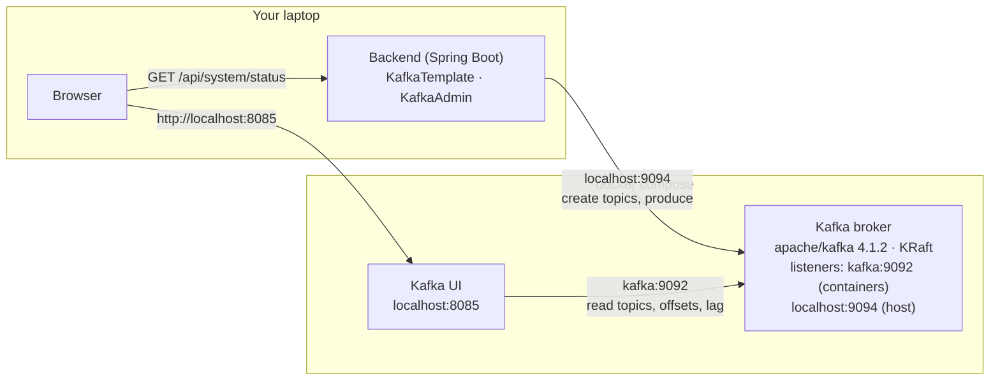
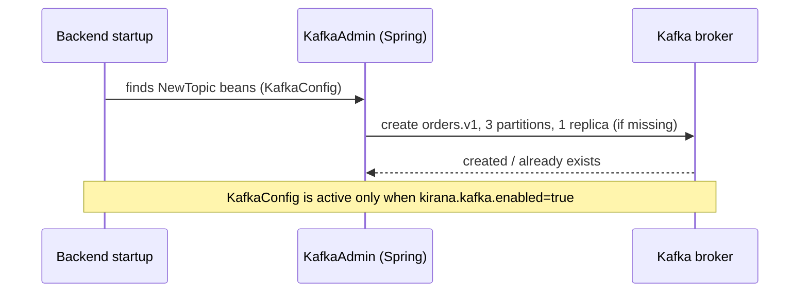
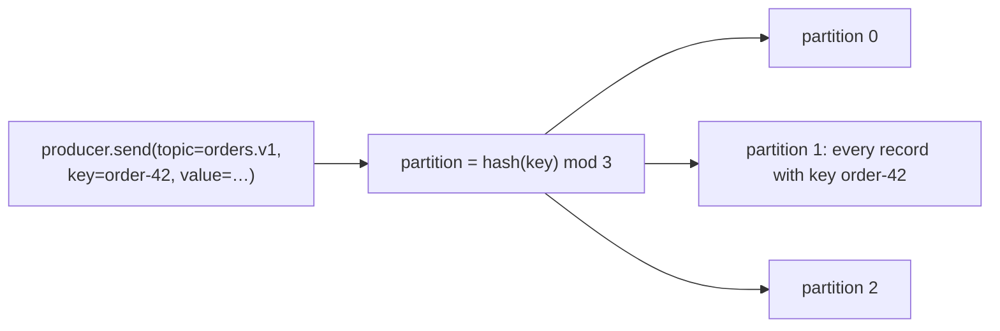
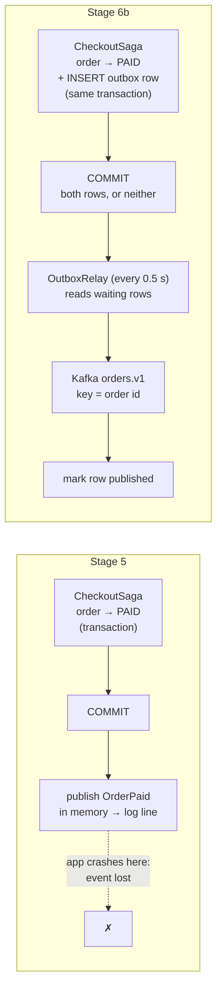

# Stage 6: Kafka — implementation log

One section per step: what was built, which problem it solves, the new code, and how a
request flows through it. Diagrams are Mermaid (GitHub renders them).

---

## 0. Where Stage 6 starts

Stage 5 made checkout correct for everything that happens **inside Kirana**: order status is a
state machine in Postgres, every change is a conditional `UPDATE`, and two jobs (reconciler,
expiry) settle every unpaid order. What is still wrong involves **money that moves after we stop
looking**:

| Gap | User story | Today |
|---|---|---|
| **G1** | Bala pays at 10:09:58, the capture lands at 10:10:03, expiry closed the order at 10:10:01, his tab is closed | Order `FAILED`, money taken, **nothing notices** (the reconciler only looks at `CREATED` orders) |
| **G2** | Same, but the browser reports it | 409 and a `REFUND NEEDED` log line; **nobody refunds** |
| **G3** | The gateway answers "unknown order" (mock restarted, wrong keys) | Expiry treats it as "not paid" and closes it |
| **Fulfilment** | A paid order should go to the warehouse | Nothing happens; adding it naively is a **dual write** |

Kafka is not the fix on its own. The fixes are webhooks (6c), a transactional outbox (6b) and
consumers (6d, 6e); Kafka is how events reach several independent consumers durably and in
order (6a, 6f).

---

## 6a. Kafka infrastructure

**Done:** a Kafka broker and Kafka UI run in Docker Compose; the backend connects with explicit
producer settings, creates its first topic (`orders.v1`, 3 partitions) at startup, reports Kafka
in the Resilience lab, and has a Kafka test container.

**Problem solved:** none for users yet. This is the plumbing every later step stands on. The
checkout flow is unchanged.

### What runs where



* **KRaft**: the broker runs its own controller (metadata quorum); no ZooKeeper.
* **Two listeners**: other containers reach the broker as `kafka:9092`; the backend on the host
  uses `localhost:9094`. A broker tells clients which address to reconnect to (the "advertised
  listener"), so each side needs its own.
* **Automatic topic creation is off**: a typo in a topic name fails instead of creating a new
  topic nobody reads.

### Startup: the backend creates its topics



### How a record finds its partition



Same key → same partition → read back in the order written. Different keys spread across
partitions, which is what lets several consumers share the work later (6f). There is **no order
across partitions**, only within one.

### New code

| File | What it does |
|---|---|
| `infra/docker-compose.yml` | `kafka` (KRaft, one node) and `kafka-ui` (port 8085) |
| `backend/pom.xml` | `spring-boot-starter-kafka`; test: `testcontainers-kafka` |
| `application.yml` → `spring.kafka.*` | bootstrap `localhost:9094`; producer `acks=all`, idempotent, 10 s delivery timeout |
| `application.yml` → `kirana.kafka.*` | `enabled` switch, partition count |
| `messaging/Topics.java` | topic names (`orders.v1`) |
| `messaging/KafkaConfig.java` | `NewTopic` beans, so the app owns its topics |
| `messaging/KafkaStatus.java` | reachability and topics for `/system/status` |
| `controller/SystemController`, `dto/SystemStatus` | `kafka` added to the status |
| `frontend/.../ResilienceLab.jsx` | Kafka card: connected, topics, link to Kafka UI |
| `src/test/resources/application.properties` | tests run with Kafka off by default |
| `KafkaContainerConfig`, `KafkaSmokeIntegrationTest` | real broker in tests; topic created; same key → same partition, in order |

### Producer settings, in plain English

| Setting | Value | Meaning |
|---|---|---|
| `acks` | `all` | the broker confirms a write only once it is stored on every in-sync copy |
| `enable.idempotence` | `true` | if a send is retried after a lost acknowledgement, the broker drops the duplicate |
| `delivery.timeout.ms` | 10 s | give up on a send after 10 s (default: 2 minutes) |
| `max.block.ms` | 5 s | don't block a caller more than 5 s when the broker is unreachable |

### Try it

```sh
cd infra && docker compose up -d kafka kafka-ui
cd ../backend && mvn spring-boot:run
```

* Kafka UI → http://localhost:8085 → cluster **kirana** → Topics: `orders.v1`, 3 partitions.
* Manage → Resilience lab: **Kafka · Connected**, `orders.v1 (3 partitions)`.
* In Kafka UI, open `orders.v1` → **Produce message**, key `order-42`, any value, three times:
  all three land in the same partition (Messages tab shows the partition and offset).

---

## 6b. Transactional outbox

**Done:** every order event (`OrderPlaced`, `OrderPaid`, `OrderClosed`, `PaymentAfterClose`) is
now written to an **`outbox` table in the same database transaction** as the order change. A
**relay** publishes waiting rows to Kafka topic `orders.v1` every half second, in order, keyed
by order id.

**Problem solved: the dual write.** A change in Postgres plus a message to another system can't
share one transaction, so one can happen without the other:

| Naive way | What can go wrong |
|---|---|
| Send to Kafka, then commit the order | the commit fails → Kafka says "order 42 paid", but it isn't (a consumer would ship an unpaid order) |
| Commit the order, then send to Kafka | the app crashes in between → "order 42 paid" is **never** announced (no shipping, no refund) |
| Stage 5 (in-memory event after commit) | the same as above: lost on a crash |

With the outbox, the event is a **row** next to the order row, so they commit together or not
at all. Delivering it to Kafka becomes a separate, retryable job.

**User-visible today:** still nothing (no consumers yet). It's the guarantee that refunds (6d)
and fulfilment (6e) will rely on: *if an order changed, the event about it will reach Kafka.*

### Before and after



### One event, step by step (shopper pays)

```mermaid
sequenceDiagram
    participant B as Browser
    participant S as CheckoutSaga
    participant DB as Postgres
    participant R as OutboxRelay
    participant K as Kafka (orders.v1)
    B->>S: POST /orders/{id}/payment/verify
    S->>DB: BEGIN
    S->>DB: UPDATE orders SET status='PAID' WHERE status='CREATED'
    S->>DB: INSERT INTO outbox (OrderPaid, key=order id)
    S->>DB: COMMIT (both rows together)
    S-->>B: 200 {status: PAID}
    Note over R: up to 0.5 s later
    R->>DB: BEGIN; SELECT … WHERE published_at IS NULL<br/>ORDER BY id FOR UPDATE SKIP LOCKED
    R->>K: send(key=order id, value=JSON, headers event-id, event-type)
    K-->>R: acknowledged (acks=all)
    R->>DB: UPDATE outbox SET published_at = now(); COMMIT
```

The shopper's request ends at the COMMIT. Kafka is never on the request's path, so a Kafka
outage does not slow or fail checkout.

### What happens when something fails

| Failure | Result | Why |
|---|---|---|
| Order transaction rolls back (e.g. out of stock) | no event | the outbox row rolled back with it |
| App crashes after COMMIT, before the relay runs | event sent after restart | the row is in Postgres, still unpublished |
| Kafka down | events wait; checkout unaffected; lab shows "N waiting" | relay retries every 0.5 s |
| Relay crashes after Kafka acknowledged, before marking the row | the event is sent **twice** | **at-least-once**: consumers must ignore an `eventId` they've seen (6c) |
| One event can't be sent | it and everything after it wait | keeps per-order order (no "Closed" before "Placed") |
| Two backend instances | each relay takes different rows | `FOR UPDATE SKIP LOCKED` skips rows another relay has locked |

### New and changed code

| File | What |
|---|---|
| `db/migration/V5__outbox.sql` | `outbox` table (`event_id` unique, `topic`, `message_key`, `event_type`, `payload`, `published_at`, `attempts`, `last_error`) + index on unpublished rows |
| `entity/OutboxMessage.java`, `repository/OutboxRepository.java` | the row, inserted through JPA |
| `service/OutboxOrderEvents.java` | **new `OrderEvents` implementation**: INSERT into the outbox, joining the caller's transaction (replaces Stage 5's in-memory `SpringOrderEvents`, now deleted). `CheckoutSaga` did not change. |
| `service/OrderService.java` | `OrderPlaced` now published **inside TX1** (it used to be published after the commit, which the outbox would not have protected) |
| `messaging/OutboxRelay.java` | the polling publisher: lock, send, wait for the acknowledgement, mark; stop at the first failure |
| `messaging/OutboxStats.java` | waiting count, age of the oldest, last error → `/system/status`, lab |
| `application.yml` | `kirana.outbox.*` (interval, batch); **scheduler pool 3 threads** (the default single thread would let the relay and the payment jobs block each other) |
| `OutboxIntegrationTest` | a rolled-back checkout leaves no event; events arrive in Kafka in order with their ids |

### Message format (topic `orders.v1`)

```
key:     "50050852"                                  ← order id: all of one order's events share a partition
headers: event-id = c67e5368-…, event-type = OrderPaid
value:   {"eventId":"c67e5368-…","type":"OrderPaid","occurredAt":"2026-10-01T20:39:23Z",
          "orderId":50050852,"data":{"orderId":50050852,"provider":"mock","paymentId":"pay_…"}}
```

### Experiment (run on the real stack)

Kafka stopped → order placed and paid → the lab shows **2 waiting** → backend killed with
`kill -9` → Kafka started → backend started → `Outbox relay: published 2 event(s)` → Kafka holds
`OrderPlaced` then `OrderPaid` for order 50050852, both on partition 1, in order.

### Try it

1. `docker stop kirana-kafka-1`, then place and pay an order in the UI. It works normally.
   Lab → Kafka card: **Unreachable**, **Outbox: 2 events waiting**.
2. Stop the backend (Ctrl+C), `docker start kirana-kafka-1`, start the backend again.
   The log shows `Outbox relay: published 2 event(s)`; the lab shows 0 waiting.
3. Kafka UI → `orders.v1` → Messages: your order's events, same partition, in order.

### Known costs

* The relay holds a database transaction while it waits for Kafka (at most a few seconds), on a
  scheduler thread. At larger scale: claim rows with a lease and publish outside the
  transaction, or use change data capture (Debezium reading Postgres's write-ahead log).
* Published rows are never deleted yet; a cleanup job comes later.
* At-least-once delivery: duplicates are possible, so every consumer must deduplicate.
