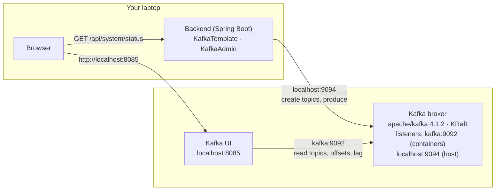
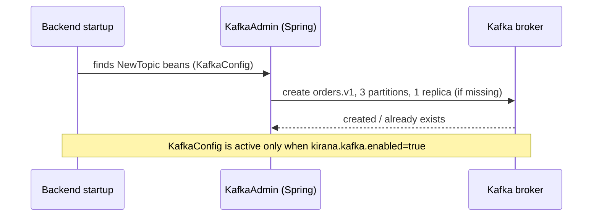
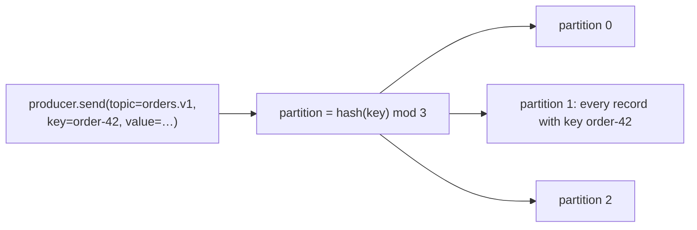
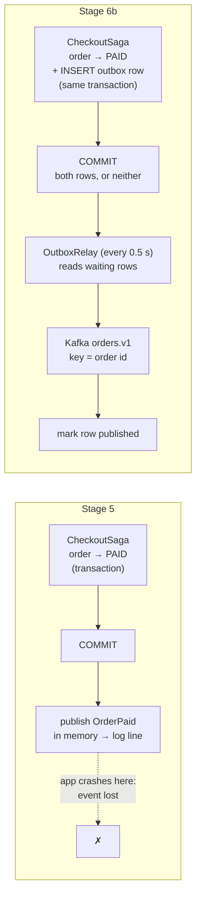
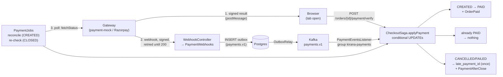
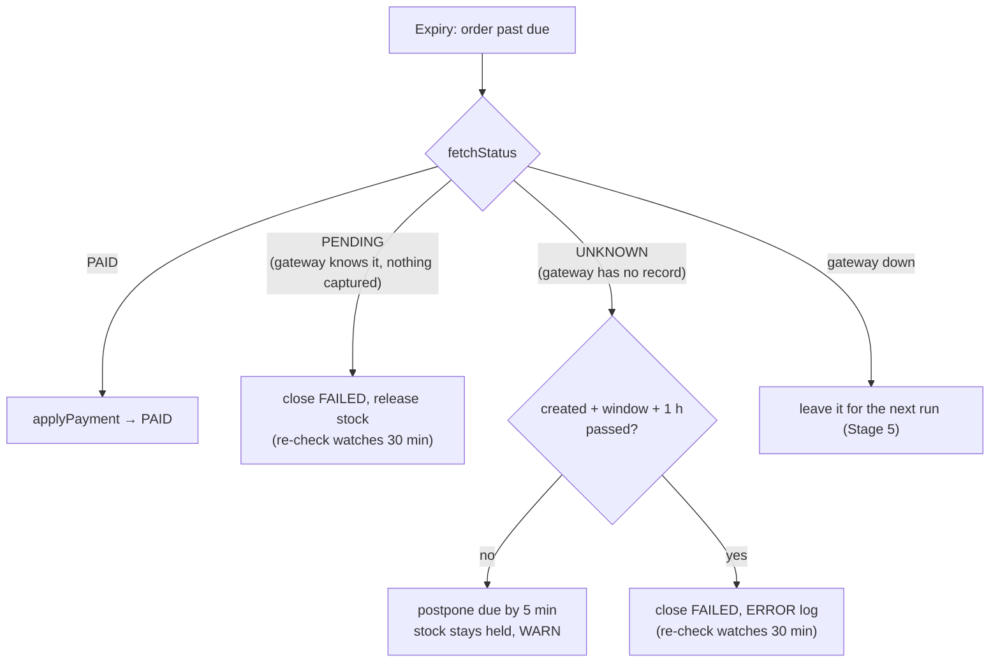

# Stage 6: Kafka — implementation log

One section per step: what was built, which problem it solves, the new code, and how a
request flows through it. Diagrams are Mermaid (GitHub renders them).

---

## 0. Where Stage 6 starts

Stage 5 made checkout correct for everything that happens **inside Kirana**: order status is a
state machine in Postgres, every change is a conditional `UPDATE`, and two jobs (reconciler,
expiry) settle every unpaid order. What is still wrong involves **money that moves after we stop
looking**:

| Gap | User story | Today |
|---|---|---|
| **G1** | Bala pays at 10:09:58, the capture lands at 10:10:03, expiry closed the order at 10:10:01, his tab is closed | Order `FAILED`, money taken, **nothing notices** (the reconciler only looks at `CREATED` orders) |
| **G2** | Same, but the browser reports it | 409 and a `REFUND NEEDED` log line; **nobody refunds** |
| **G3** | The gateway answers "unknown order" (mock restarted, wrong keys) | Expiry treats it as "not paid" and closes it |
| **Fulfilment** | A paid order should go to the warehouse | Nothing happens; adding it naively is a **dual write** |

Kafka is not the fix on its own. The fixes are webhooks (6c), a transactional outbox (6b) and
consumers (6d, 6e); Kafka is how events reach several independent consumers durably and in
order (6a, 6f).

---

## 6a. Kafka infrastructure

**Done:** a Kafka broker and Kafka UI run in Docker Compose; the backend connects with explicit
producer settings, creates its first topic (`orders.v1`, 3 partitions) at startup, reports Kafka
in the Resilience lab, and has a Kafka test container.

**Problem solved:** none for users yet. This is the plumbing every later step stands on. The
checkout flow is unchanged.

### What runs where



* **KRaft**: the broker runs its own controller (metadata quorum); no ZooKeeper.
* **Two listeners**: other containers reach the broker as `kafka:9092`; the backend on the host
  uses `localhost:9094`. A broker tells clients which address to reconnect to (the "advertised
  listener"), so each side needs its own.
* **Automatic topic creation is off**: a typo in a topic name fails instead of creating a new
  topic nobody reads.

### Startup: the backend creates its topics



### How a record finds its partition



Same key → same partition → read back in the order written. Different keys spread across
partitions, which is what lets several consumers share the work later (6f). There is **no order
across partitions**, only within one.

### New code

| File | What it does |
|---|---|
| `infra/docker-compose.yml` | `kafka` (KRaft, one node) and `kafka-ui` (port 8085) |
| `backend/pom.xml` | `spring-boot-starter-kafka`; test: `testcontainers-kafka` |
| `application.yml` → `spring.kafka.*` | bootstrap `localhost:9094`; producer `acks=all`, idempotent, 10 s delivery timeout |
| `application.yml` → `kirana.kafka.*` | `enabled` switch, partition count |
| `messaging/Topics.java` | topic names (`orders.v1`) |
| `messaging/KafkaConfig.java` | `NewTopic` beans, so the app owns its topics |
| `messaging/KafkaStatus.java` | reachability and topics for `/system/status` |
| `controller/SystemController`, `dto/SystemStatus` | `kafka` added to the status |
| `frontend/.../ResilienceLab.jsx` | Kafka card: connected, topics, link to Kafka UI |
| `src/test/resources/application.properties` | tests run with Kafka off by default |
| `KafkaContainerConfig`, `KafkaSmokeIntegrationTest` | real broker in tests; topic created; same key → same partition, in order |

### Producer settings, in plain English

| Setting | Value | Meaning |
|---|---|---|
| `acks` | `all` | the broker confirms a write only once it is stored on every in-sync copy |
| `enable.idempotence` | `true` | if a send is retried after a lost acknowledgement, the broker drops the duplicate |
| `delivery.timeout.ms` | 10 s | give up on a send after 10 s (default: 2 minutes) |
| `max.block.ms` | 5 s | don't block a caller more than 5 s when the broker is unreachable |

### Try it

```sh
cd infra && docker compose up -d kafka kafka-ui
cd ../backend && mvn spring-boot:run
```

* Kafka UI → http://localhost:8085 → cluster **kirana** → Topics: `orders.v1`, 3 partitions.
* Manage → Resilience lab: **Kafka · Connected**, `orders.v1 (3 partitions)`.
* In Kafka UI, open `orders.v1` → **Produce message**, key `order-42`, any value, three times:
  all three land in the same partition (Messages tab shows the partition and offset).

---

## 6b. Transactional outbox

**Done:** every order event (`OrderPlaced`, `OrderPaid`, `OrderClosed`, `PaymentAfterClose`) is
now written to an **`outbox` table in the same database transaction** as the order change. A
**relay** publishes waiting rows to Kafka topic `orders.v1` every half second, in order, keyed
by order id.

**Problem solved: the dual write.** A change in Postgres plus a message to another system can't
share one transaction, so one can happen without the other:

| Naive way | What can go wrong |
|---|---|
| Send to Kafka, then commit the order | the commit fails → Kafka says "order 42 paid", but it isn't (a consumer would ship an unpaid order) |
| Commit the order, then send to Kafka | the app crashes in between → "order 42 paid" is **never** announced (no shipping, no refund) |
| Stage 5 (in-memory event after commit) | the same as above: lost on a crash |

With the outbox, the event is a **row** next to the order row, so they commit together or not
at all. Delivering it to Kafka becomes a separate, retryable job.

**User-visible today:** still nothing (no consumers yet). It's the guarantee that refunds (6d)
and fulfilment (6e) will rely on: *if an order changed, the event about it will reach Kafka.*

### Before and after



### One event, step by step (shopper pays)

```mermaid
sequenceDiagram
    participant B as Browser
    participant S as CheckoutSaga
    participant DB as Postgres
    participant R as OutboxRelay
    participant K as Kafka (orders.v1)
    B->>S: POST /orders/{id}/payment/verify
    S->>DB: BEGIN
    S->>DB: UPDATE orders SET status='PAID' WHERE status='CREATED'
    S->>DB: INSERT INTO outbox (OrderPaid, key=order id)
    S->>DB: COMMIT (both rows together)
    S-->>B: 200 {status: PAID}
    Note over R: up to 0.5 s later
    R->>DB: BEGIN; SELECT … WHERE published_at IS NULL<br/>ORDER BY id FOR UPDATE SKIP LOCKED
    R->>K: send(key=order id, value=JSON, headers event-id, event-type)
    K-->>R: acknowledged (acks=all)
    R->>DB: UPDATE outbox SET published_at = now(); COMMIT
```

The shopper's request ends at the COMMIT. Kafka is never on the request's path, so a Kafka
outage does not slow or fail checkout.

### What happens when something fails

| Failure | Result | Why |
|---|---|---|
| Order transaction rolls back (e.g. out of stock) | no event | the outbox row rolled back with it |
| App crashes after COMMIT, before the relay runs | event sent after restart | the row is in Postgres, still unpublished |
| Kafka down | events wait; checkout unaffected; lab shows "N waiting" | relay retries every 0.5 s |
| Relay crashes after Kafka acknowledged, before marking the row | the event is sent **twice** | **at-least-once**: consumers must ignore an `eventId` they've seen (6c) |
| One event can't be sent | it and everything after it wait | keeps per-order order (no "Closed" before "Placed") |
| Two backend instances | each relay takes different rows | `FOR UPDATE SKIP LOCKED` skips rows another relay has locked |

### New and changed code

| File | What |
|---|---|
| `db/migration/V5__outbox.sql` | `outbox` table (`event_id` unique, `topic`, `message_key`, `event_type`, `payload`, `published_at`, `attempts`, `last_error`) + index on unpublished rows |
| `entity/OutboxMessage.java`, `repository/OutboxRepository.java` | the row, inserted through JPA |
| `service/OutboxOrderEvents.java` | **new `OrderEvents` implementation**: INSERT into the outbox, joining the caller's transaction (replaces Stage 5's in-memory `SpringOrderEvents`, now deleted). `CheckoutSaga` did not change. |
| `service/OrderService.java` | `OrderPlaced` now published **inside TX1** (it used to be published after the commit, which the outbox would not have protected) |
| `messaging/OutboxRelay.java` | the polling publisher: lock, send, wait for the acknowledgement, mark; stop at the first failure |
| `messaging/OutboxStats.java` | waiting count, age of the oldest, last error → `/system/status`, lab |
| `application.yml` | `kirana.outbox.*` (interval, batch); **scheduler pool 3 threads** (the default single thread would let the relay and the payment jobs block each other) |
| `OutboxIntegrationTest` | a rolled-back checkout leaves no event; events arrive in Kafka in order with their ids |

### Message format (topic `orders.v1`)

```
key:     "50050852"                                  ← order id: all of one order's events share a partition
headers: event-id = c67e5368-…, event-type = OrderPaid
value:   {"eventId":"c67e5368-…","type":"OrderPaid","occurredAt":"2026-10-01T20:39:23Z",
          "orderId":50050852,"data":{"orderId":50050852,"provider":"mock","paymentId":"pay_…"}}
```

### Experiment (run on the real stack)

Kafka stopped → order placed and paid → the lab shows **2 waiting** → backend killed with
`kill -9` → Kafka started → backend started → `Outbox relay: published 2 event(s)` → Kafka holds
`OrderPlaced` then `OrderPaid` for order 50050852, both on partition 1, in order.

### Try it

1. `docker stop kirana-kafka-1`, then place and pay an order in the UI. It works normally.
   Lab → Kafka card: **Unreachable**, **Outbox: 2 events waiting**.
2. Stop the backend (Ctrl+C), `docker start kirana-kafka-1`, start the backend again.
   The log shows `Outbox relay: published 2 event(s)`; the lab shows 0 waiting.
3. Kafka UI → `orders.v1` → Messages: your order's events, same partition, in order.

### Known costs

* The relay holds a database transaction while it waits for Kafka (at most a few seconds), on a
  scheduler thread. At larger scale: claim rows with a lease and publish outside the
  transaction, or use change data capture (Debezium reading Postgres's write-ahead log).
* Published rows are never deleted yet; a cleanup job comes later.
* At-least-once delivery: duplicates are possible, so every consumer must deduplicate.

---

## 6c. Late-payment detection (webhooks, the first consumer)

**Done:** payment-mock now **pushes** signed webhooks (`payment.captured` / `payment.failed`)
and retries them until Kirana answers 200. Kirana checks the signature, writes the event to the
outbox on a new topic **`payments.v1`**, and the **first Kafka consumer** applies it to the
order. A payment for an order that already closed is recorded as a **late payment** (refund due),
once. Two smaller fixes go with it: a re-check job for closed orders, and "unknown" no longer
closes an order.

**Problems solved:**

| Gap | Before | Now |
|---|---|---|
| Tab closed after paying | order stays "Awaiting payment" until the reconciler runs (1–1.5 min) | **PAID in ~0.5 s** via webhook |
| **G1**: captured after expiry/cancel, nobody reports it | order `FAILED`, money taken, **silence** | webhook (or the re-check job) → `latePaymentId` set, `PaymentAfterClose` raised **once**, "Refund due" on the Orders page |
| **G3**: gateway says "unknown order" at expiry | closed as unpaid | held 5 min at a time, up to 1 h, then closed with an error log; re-check still watches |

### Three ways a payment reaches Kirana now



All three paths end in **one method**, `applyPayment`, and every branch in it is a
conditional `UPDATE`. So it doesn't matter which path arrives first or how many times each one
fires.

### Use case: Asha pays, closes the tab

```mermaid
sequenceDiagram
    participant A as Asha's browser
    participant G as payment-mock
    participant W as Kirana webhook endpoint
    participant DB as Postgres
    participant R as OutboxRelay
    participant K as Kafka payments.v1
    participant L as PaymentEventsListener
    A->>G: pays on the checkout page
    A--xA: closes the tab (verify never sent)
    G->>W: POST /webhooks/payment/mock<br/>X-Razorpay-Signature, X-Razorpay-Event-Id
    W->>W: HMAC(raw body, webhook secret) matches?
    W->>DB: find order by gateway order id
    W->>DB: INSERT outbox (PaymentCaptured, key = order id,<br/>event_id = UUID from gateway event id); COMMIT
    W-->>G: 200 (gateway stops retrying)
    R->>K: send (≤ 0.5 s later)
    K->>L: deliver
    L->>DB: BEGIN
    L->>DB: INSERT processed_events (kirana-payments, event_id)<br/>ON CONFLICT DO NOTHING → 1 row = first time
    L->>DB: UPDATE orders SET status='PAID' WHERE status='CREATED'
    L->>DB: INSERT outbox (OrderPaid → orders.v1)
    L->>DB: COMMIT
    L->>K: commit offset (ack)
    Note over A: Orders page refreshes every 5 s while<br/>an order awaits payment → "Paid"
```

Measured on the real stack: **0.50 s** from payment to `PAID`, with no verify call.

### Use case: Bala's payment lands after the order closed (G1)

```mermaid
sequenceDiagram
    participant E as Expiry job / Bala cancels
    participant G as payment-mock
    participant L as PaymentEventsListener
    participant DB as Postgres
    E->>DB: CREATED → FAILED/CANCELLED, stock released
    G->>G: capture completes anyway
    G->>L: webhook → outbox → Kafka (as above)
    L->>DB: UPDATE … SET status='PAID' WHERE status='CREATED' → 0 rows
    L->>DB: UPDATE … SET late_payment_id=? WHERE late_payment_id IS NULL<br/>AND status IN (CANCELLED, FAILED) → 1 row
    L->>DB: INSERT outbox PaymentAfterClose (→ orders.v1, for 6d's refund consumer)
    Note over DB: the order stays CANCELLED/FAILED;<br/>Orders page shows "Refund due"
```

If the webhook never comes (disabled, misconfigured, lost), the **re-check job** asks the
gateway about every order closed in the last 30 minutes, every 2 minutes, and reaches the same
`applyPayment`.

### Duplicates: three layers

| Where | Catches | How |
|---|---|---|
| Webhook endpoint | the gateway retrying or sending the same event twice | outbox `event_id` = UUID derived from the gateway's event id; second insert hits `UNIQUE` → "duplicate ignored", still 200 |
| Consumer (inbox) | Kafka redelivering a record (app died after the DB commit, before the offset commit; relay sent twice) | `processed_events (consumer, event_id)` row in the same transaction as the work |
| The order itself | the same payment reported by browser + webhook + re-check | conditional `UPDATE`s: only the first gets 1 row |

For payments, layer 3 alone would already be enough. The inbox is there because 6d (refund API
call) and 6e (warehouse call) have effects that are **not** naturally idempotent.

### G3: unknown is not "not paid"



Postponing `payment_due_at` also sends the order to the back of the expiry queue, so a pile of
UNKNOWN orders can't starve the others out of the 50-order batch.

### New and changed code

| File | What |
|---|---|
| `payment-mock/app.py` | webhook sender: HMAC-SHA256 of the raw body with `WEBHOOK_SECRET`, event id header, retries after 1, 2, 4, 8, 16, 32 s; `/admin/webhooks` (`enabled`, `duplicate`, `url`), `/admin/webhooks/deliveries` |
| `infra/docker-compose.yml` | `WEBHOOK_URL` (→ `host.docker.internal:8080`), `WEBHOOK_SECRET`, `extra_hosts` |
| `db/migration/V6__payment_events.sql` | `orders.late_payment_id`; `processed_events (consumer, event_id)` |
| `controller/WebhookController.java` | `POST /webhooks/payment/{provider}`, body as the raw string (re-serialising would break the signature) |
| `service/PaymentWebhooks.java` | verify → find order → outbox row on `payments.v1`; duplicate → 200 |
| `service/OutboxWriter.java` | the envelope + insert, shared by order events and payment events (`OutboxOrderEvents` now uses it) |
| `messaging/PaymentEventsListener.java` | **first consumer**: `@KafkaListener`, group `kirana-payments`, inbox + `applyPayment` in one transaction, then `ack` |
| `messaging/Inbox.java` | `INSERT … ON CONFLICT DO NOTHING` → first delivery or not |
| `messaging/KafkaConfig.java`, `Topics.java` | `payments.v1` (3 partitions); `DefaultErrorHandler`: 3 retries 1 s apart, then log and skip (DLQ in 6f) |
| `application.yml` | consumer: `enable-auto-commit: false`, `auto-offset-reset: earliest`, `ack-mode: manual`; `recheck-closed-for`, `unknown-grace`, mock `webhook-secret`; scheduler pool 4 |
| `service/CheckoutSaga.java` | `applyPayment` → `PAID / ALREADY_PAID / PAID_AFTER_CLOSE` (never throws; `confirmPayment` wraps it for the browser); `recheckClosed`; `expire` handles UNKNOWN |
| `service/PaymentJobs.java` | `recheckClosed()` every 2 min |
| `repository/OrderRepository.java` | `markLatePayment`, `postponeDue`, `findRecentlyClosedIds`, `findByPaymentProviderAndGatewayOrderId` |
| `payment/*` | `verifyWebhook` on the gateway port; `webhookSecret` per gateway |
| `entity/Order`, `OrderResponse`, `OrderMapper` | `latePaymentId` |
| `frontend/…/Orders.jsx` | "Refund due" line; refresh every 5 s while an order awaits payment |
| Tests | `PaymentWebhookIntegrationTest` (webhook → Kafka → PAID; late payment with a Kafka redelivery → one refund event; inbox); saga tests for UNKNOWN, late payment reported 4 ways, re-check after expiry. **82 tests pass.** |

### Message format (topic `payments.v1`)

```
key:     "50050902"                       ← our order id (the endpoint looked it up)
headers: event-id = f9ad4b05-6903-3568-…  (name-based UUID of the gateway's evt_…), event-type = PaymentCaptured
value:   {"eventId":"f9ad4b05-…","type":"PaymentCaptured","occurredAt":"…","orderId":50050902,
          "data":{"provider":"mock","gatewayEventId":"evt_…","gatewayOrderId":"order_MBCZ…",
                  "paymentId":"pay_1dzg…","status":"captured"}}
```

### Experiments (run on the real stack)

| # | Setup | Result |
|---|---|---|
| 1 | pay, never call verify (tab closed) | `PAID` after **0.50 s**; log: `Webhook from mock … queued` → `payments.v1 p0@0: PaymentCaptured … -> order PAID` |
| 2 | cancel, then pay; mock `duplicate: true` | 2 deliveries: 1 `queued`, 1 `duplicate ignored`; order stays `CANCELLED`, `latePaymentId` set; outbox for the order: OrderPlaced 1, OrderClosed 1, PaymentCaptured 1, **PaymentAfterClose 1** |
| 3 | `kill -9` the backend, pay, restart it | mock: attempts 1–4 `URLError`, attempt 5 → 200 (webhook retries bridged the outage). Then a surprise: the order became `PAID` **27 s after** the webhook was stored. The killed instance still owned the partitions until the broker's session timeout (45 s) ran out; then the group rebalanced and the event was processed. **Late, not lost.** (6f looks at this properly.) |

### Try it

Restart your backend first (it applies V6 and starts the consumer; the log shows
`kirana-payments: partitions assigned: [payments.v1-0, payments.v1-1, payments.v1-2]`).

1. **Tab closed:** place an order with the test gateway, pay, and close the payment window
   *before* the "paid" message (or pay in the gateway page opened directly at
   `http://localhost:8090/checkout/<gatewayOrderId>`). Orders page → **Paid** within ~5 s.
2. **Late payment:** place an order, open its payment window, cancel the order from another tab,
   then pay. Orders → Cancelled with **"Refund due"**; log `REFUND NEEDED`; Kafka UI → `orders.v1`
   → `PaymentAfterClose`.
3. **Duplicates:** `curl -XPOST localhost:8090/admin/webhooks -H 'Content-Type: application/json' -d '{"duplicate":true}'`,
   pay an order, and watch the log for `duplicate ignored`. See what the gateway did:
   `curl localhost:8090/admin/webhooks/deliveries`.
4. **No webhooks** (`{"enabled":false}`): it still works, now via the reconciler (≤ 1.5 min) or the
   re-check job (≤ 2 min) — the polling safety net.
5. Kafka UI → Consumers → `kirana-payments`: committed offsets and lag per partition.

### Known costs

* One more hop: webhook → outbox → relay → Kafka → consumer adds ~0.5 s (relay interval).
* A record that keeps failing is retried 3 times and then **skipped** (logged only). The
  re-check job would still catch a skipped capture; a dead-letter topic comes in 6f.
* The re-check job asks the gateway about every closed order up to 15 times in 30 min. Fine at
  this scale; with webhooks reliable, it could run far less often.
* Real Razorpay webhooks need a public URL (a tunnel such as ngrok) and
  `RAZORPAY_WEBHOOK_SECRET`; the endpoint already supports `/webhooks/payment/razorpay`.
* Refunds are still only an event (`PaymentAfterClose`); 6d makes something act on it.

---

## Watching it live (logs, Kafka UI, database)

The backend also writes its log to `backend/logs/kirana.log` (when started from `backend/`).
Follow only the Stage 6 flow, without the SQL lines:

```bash
tail -f backend/logs/kirana.log | grep --line-buffered -E \
  "Outbox|Webhook from|payments.v1 p|REFUND|Reconciler|Re-check|Expiry|partitions assigned"
docker logs -f kirana-payment-mock-1 2>&1 | grep --line-buffered -E "payment pay_|webhook"
```

One order, start to finish (real output; note the thread on each line):

```
15:11:21.185 [http-nio-exec-3]  Outbox: OrderPlaced for order 50050952 queued as d0b86d4d…          ← TX1 (request thread)
15:11:21.433 [scheduling-1]     Outbox relay: OrderPlaced for order 50050952 -> orders.v1 partition 0 offset 5
             (mock)             payment pay_Khl1… for order_RBt2…: captured
             (mock)             webhook evt_db62… payment.captured for order_RBt2…: attempt 1 -> 200
15:11:22.366 [http-nio-exec-4]  Webhook from mock: payment.captured for order 50050952 … queued as 237aafcf…
15:11:22.463 [scheduling-1]     Outbox relay: PaymentCaptured for order 50050952 -> payments.v1 partition 0 offset 2
15:11:22.476 [payments-listener] Outbox: OrderPaid for order 50050952 queued as 8b1d3eac…           ← consumer's transaction
15:11:22.477 [payments-listener] payments.v1 p0@2: PaymentCaptured for order 50050952 -> order PAID
15:11:22.983 [scheduling-1]     Outbox relay: OrderPaid for order 50050952 -> orders.v1 partition 0 offset 6
```
