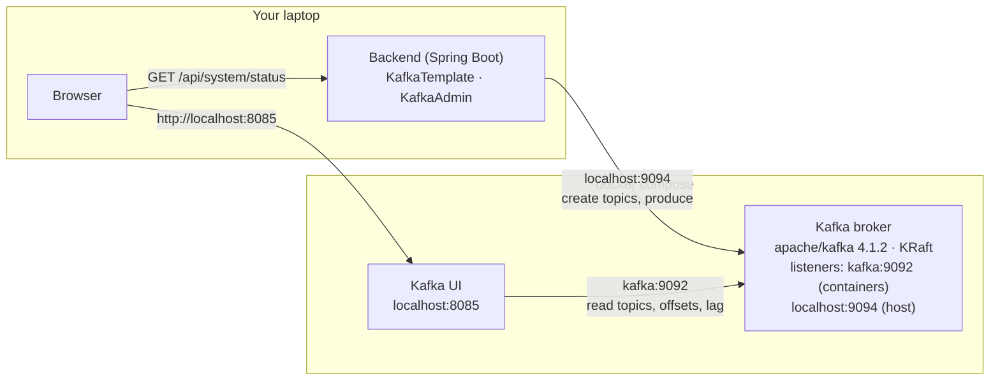
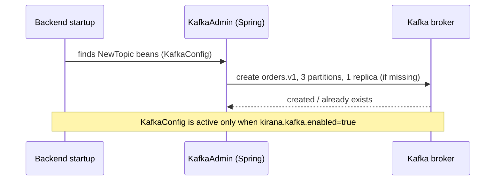
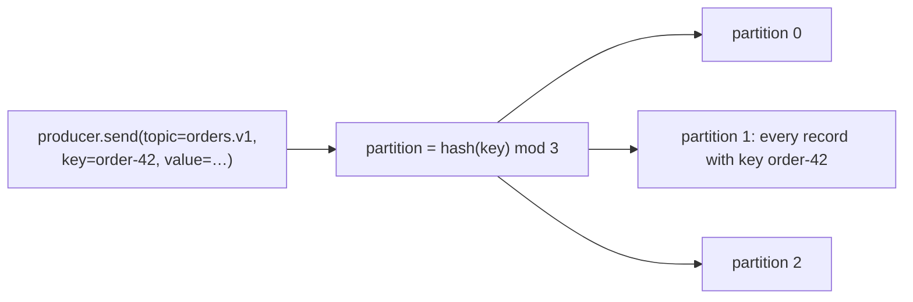

# Stage 6: Kafka — implementation log

One section per step: what was built, which problem it solves, the new code, and how a
request flows through it. Diagrams are Mermaid (GitHub renders them).

---

## 0. Where Stage 6 starts

Stage 5 made checkout correct for everything that happens **inside Kirana**: order status is a
state machine in Postgres, every change is a conditional `UPDATE`, and two jobs (reconciler,
expiry) settle every unpaid order. What is still wrong involves **money that moves after we stop
looking**:

| Gap | User story | Today |
|---|---|---|
| **G1** | Bala pays at 10:09:58, the capture lands at 10:10:03, expiry closed the order at 10:10:01, his tab is closed | Order `FAILED`, money taken, **nothing notices** (the reconciler only looks at `CREATED` orders) |
| **G2** | Same, but the browser reports it | 409 and a `REFUND NEEDED` log line; **nobody refunds** |
| **G3** | The gateway answers "unknown order" (mock restarted, wrong keys) | Expiry treats it as "not paid" and closes it |
| **Fulfilment** | A paid order should go to the warehouse | Nothing happens; adding it naively is a **dual write** |

Kafka is not the fix on its own. The fixes are webhooks (6c), a transactional outbox (6b) and
consumers (6d, 6e); Kafka is how events reach several independent consumers durably and in
order (6a, 6f).

---

## 6a. Kafka infrastructure

**Done:** a Kafka broker and Kafka UI run in Docker Compose; the backend connects with explicit
producer settings, creates its first topic (`orders.v1`, 3 partitions) at startup, reports Kafka
in the Resilience lab, and has a Kafka test container.

**Problem solved:** none for users yet. This is the plumbing every later step stands on. The
checkout flow is unchanged.

### What runs where



* **KRaft**: the broker runs its own controller (metadata quorum); no ZooKeeper.
* **Two listeners**: other containers reach the broker as `kafka:9092`; the backend on the host
  uses `localhost:9094`. A broker tells clients which address to reconnect to (the "advertised
  listener"), so each side needs its own.
* **Automatic topic creation is off**: a typo in a topic name fails instead of creating a new
  topic nobody reads.

### Startup: the backend creates its topics



### How a record finds its partition



Same key → same partition → read back in the order written. Different keys spread across
partitions, which is what lets several consumers share the work later (6f). There is **no order
across partitions**, only within one.

### New code

| File | What it does |
|---|---|
| `infra/docker-compose.yml` | `kafka` (KRaft, one node) and `kafka-ui` (port 8085) |
| `backend/pom.xml` | `spring-boot-starter-kafka`; test: `testcontainers-kafka` |
| `application.yml` → `spring.kafka.*` | bootstrap `localhost:9094`; producer `acks=all`, idempotent, 10 s delivery timeout |
| `application.yml` → `kirana.kafka.*` | `enabled` switch, partition count |
| `messaging/Topics.java` | topic names (`orders.v1`) |
| `messaging/KafkaConfig.java` | `NewTopic` beans, so the app owns its topics |
| `messaging/KafkaStatus.java` | reachability and topics for `/system/status` |
| `controller/SystemController`, `dto/SystemStatus` | `kafka` added to the status |
| `frontend/.../ResilienceLab.jsx` | Kafka card: connected, topics, link to Kafka UI |
| `src/test/resources/application.properties` | tests run with Kafka off by default |
| `KafkaContainerConfig`, `KafkaSmokeIntegrationTest` | real broker in tests; topic created; same key → same partition, in order |

### Producer settings, in plain English

| Setting | Value | Meaning |
|---|---|---|
| `acks` | `all` | the broker confirms a write only once it is stored on every in-sync copy |
| `enable.idempotence` | `true` | if a send is retried after a lost acknowledgement, the broker drops the duplicate |
| `delivery.timeout.ms` | 10 s | give up on a send after 10 s (default: 2 minutes) |
| `max.block.ms` | 5 s | don't block a caller more than 5 s when the broker is unreachable |

### Try it

```sh
cd infra && docker compose up -d kafka kafka-ui
cd ../backend && mvn spring-boot:run
```

* Kafka UI → http://localhost:8085 → cluster **kirana** → Topics: `orders.v1`, 3 partitions.
* Manage → Resilience lab: **Kafka · Connected**, `orders.v1 (3 partitions)`.
* In Kafka UI, open `orders.v1` → **Produce message**, key `order-42`, any value, three times:
  all three land in the same partition (Messages tab shows the partition and offset).
