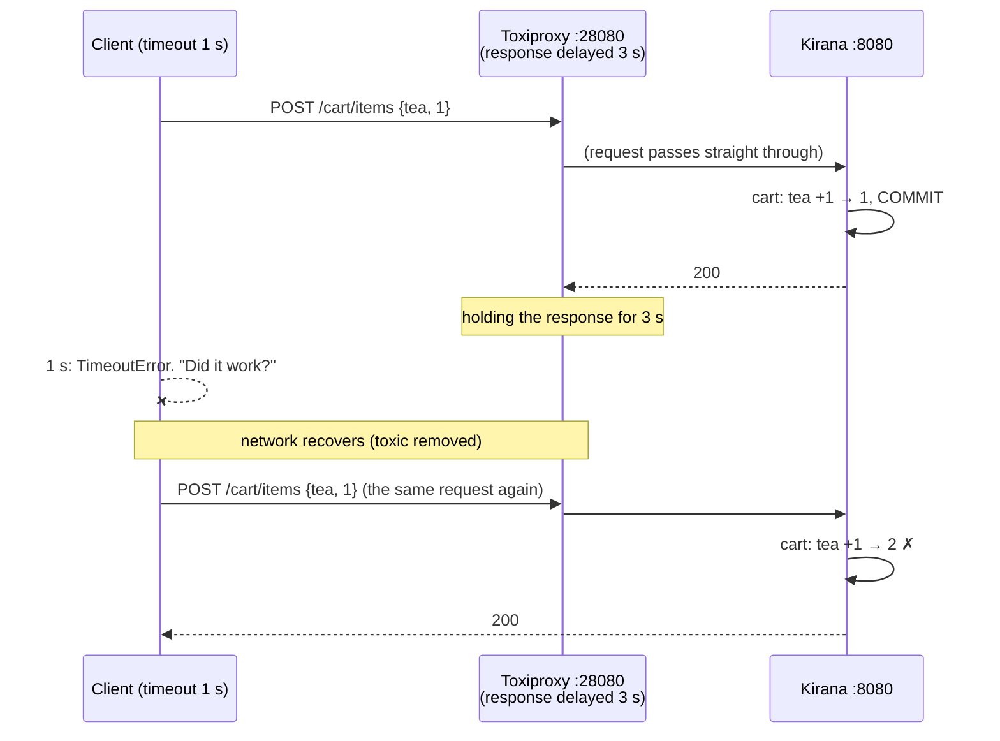
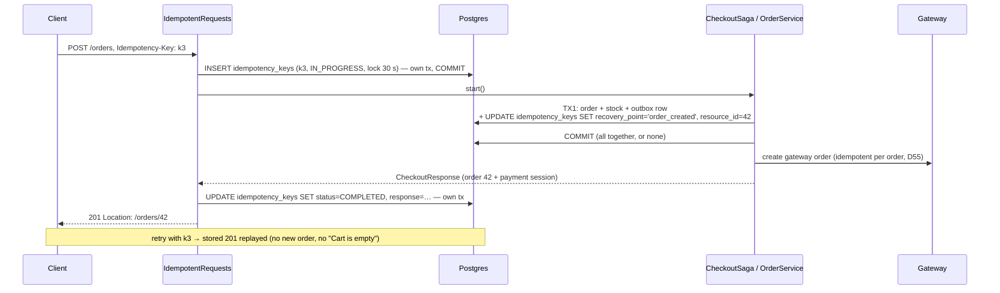
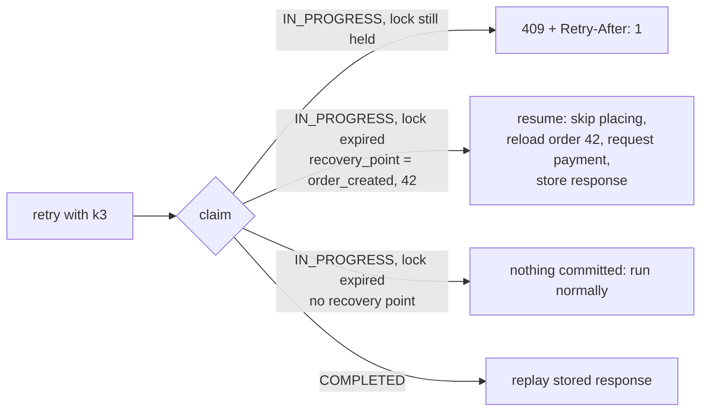
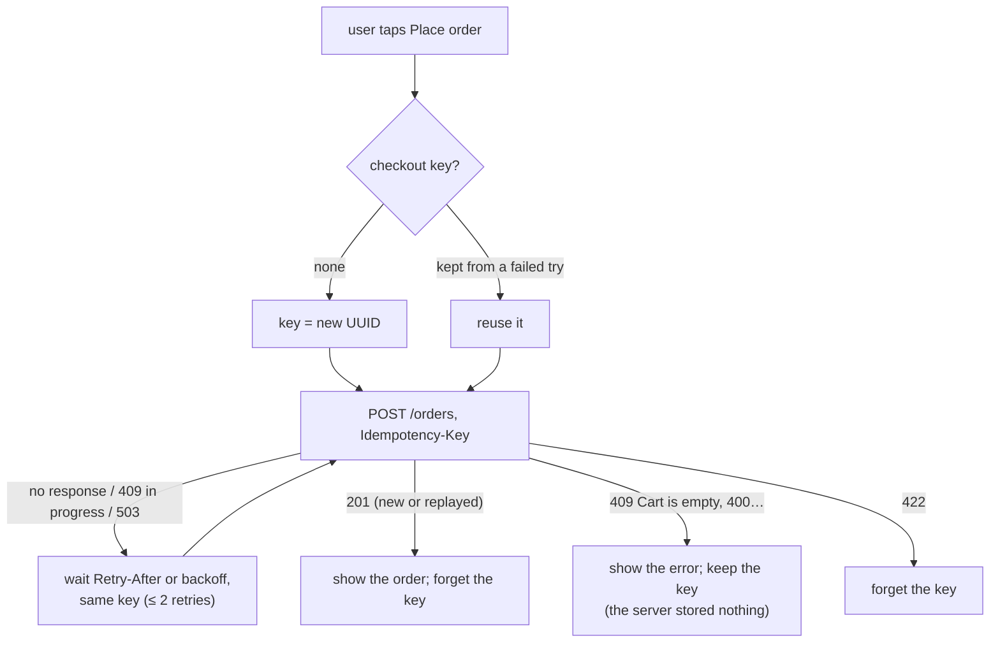

# Stage 7: Idempotency — implementation log

One section per step: what was built, which problem it solves, the new code, and how a
request flows through it. Diagrams are Mermaid (GitHub renders them).

---

## 0. Where Stage 7 starts

**Idempotency** is a property: doing something twice has the same effect as doing it once. An
**idempotency key** is one way to get it: the caller makes up a unique id for one intended
action, sends it with every attempt, and the server stores "key → result" and replays the
result for a repeat.

After Stage 6, Kirana has the property almost everywhere *inside*:

| Where | Mechanism | Identity used |
|---|---|---|
| Razorpay order per Kirana order | stored and reused (D55) | our order id |
| verify payment | conditional `UPDATE … WHERE status='CREATED'` | order id |
| webhooks | outbox `event_id` derived from the gateway's event id (unique) | gateway event id |
| Kafka consumers | `processed_events` + conditional updates | event id |
| refunds | `payment_id UNIQUE`, lease, ask first | payment id |
| warehouse | `Idempotency-Key: kirana-order-{id}` (a real key, sent by us) | order id |

The gap is the **edge**: Kirana's own API. A client's retry carries no identity. Two
`POST /cart/items {tea, 1}` look the same whether they are a retry (add 1 in total) or a second
tap (add 2). Only the client knows, and an idempotency key is how it says so.

Plan and decisions: `CLAUDE.md` (Stage 7 plan), D69: the key is **required** on
`POST /cart/items`, `POST /orders`, `POST /orders/{id}/payment`, `POST /orders/{id}/cancel`,
and every client is updated.

---

## 7a. Reproducing the problem

**Done:** a script, `infra/perf/duplicate_demo.py`, and a Toxiproxy route in front of the
backend's API (`localhost:28080` → `:8080`), so a client can lose a **response**.

**Why a lost response, not a lost request:** if the request is lost, nothing happened and a
retry is harmless. The dangerous case is the server doing the work and the answer never
arriving: a slow mobile network, a load balancer timeout, a client with a short timeout. The
client can't tell which happened, so it retries.



### Result (real stack)

```
1. Add 1 tea to the cart; the response is lost; the client retries
   client saw: no response (TimeoutError), then 200
   server: cart has 2 tea  <-- wanted 1
2. Place the order; the response is lost; the client retries
   client saw: no response (TimeoutError), then 409 Cart is empty
   server: 1 order(s) exist: [50051202]; the client does NOT know its order id
3. Pay now on that order; the response is lost; the client retries
   client saw: no response (TimeoutError), then 200 (gateway order order_NPBHpw88mdwbIQ)
   (already safe without a key: D55 reuses the order's one gateway order)
4. Cancel it; the response is lost; the client retries
   client saw: no response (TimeoutError), then 409 Order not awaiting payment: Order 50051202 is CANCELLED
   server: order 50051202 is CANCELLED  <-- the cancel worked, but the client was told it failed
```

| # | Endpoint | Kind of failure | Why |
|---|---|---|---|
| P2 | add to cart | **wrong data**: a duplicate effect | the operation is "increment", which isn't idempotent |
| P1 | place order | **wrong answer**: no duplicate (the empty cart stopped it), but the client lost its order | the second request is judged on today's state, not recognised as a repeat |
| — | pay now | none | naturally idempotent since D55 |
| P3 | cancel | **wrong answer**: told "failed" although it worked | same as P1 |

Two different problems, one fix. A key stops the duplicate effect (P2) *and* lets the server
return the first answer (P1, P3). Pay now is already safe; it gets a key anyway for one uniform
rule (D69).

### New code

| File | What |
|---|---|
| `infra/toxiproxy/toxiproxy.json`, `infra/docker-compose.yml` | proxy `kirana-api`: `28080` → `host.docker.internal:8080` |
| `infra/perf/duplicate_demo.py` | four scenarios: delay the response 3 s (client gives up after 1 s), retry, check what the server did; sends one key per action (`--no-keys`: none, as before Stage 7) |

### Try it

`docker compose up -d toxiproxy` (picks up the new route), backend on 8080, then
`python3 infra/perf/duplicate_demo.py --no-keys` (the output above, on a pre-Stage-7 backend; since
7b it gets 400s). Without `--no-keys` it sends a key per action and every scenario is fixed (7b).

---

## 7b. Idempotency keys in Postgres

**Done:** the four mutating shopper endpoints require an `Idempotency-Key` header and run each
key at most once. The rules follow the IETF draft *The Idempotency-Key HTTP Header Field*
(the same rules Stripe, Adyen and PayPal use):

| Situation | Answer |
|---|---|
| no key | **400** `errors: [{field: "Idempotency-Key", …}]` |
| new key | run it; store the response with the key |
| key seen, that request **finished** | **replay** the stored status, body and `Location`; header `Idempotent-Replayed: true` |
| key seen, that request **still running** | **409** "Request in progress" + `Retry-After: 1` |
| key seen, **different** request (endpoint or body) | **422** "Idempotency-Key reused" |
| key seen, its attempt **died** (lock expired) | run again, **resuming after its last recovery point** |

Keys are per shopper (`user_id` + key), kept 24 h, then deleted hourly.

### The hard part: "save the key" and "do the work" must agree

The obvious version is: claim the key, do the work, store the response. It has a hole:

| Crash between… | Naive result |
|---|---|
| doing the work and storing the response | the key says "in progress" but the work happened. When the lock expires, a retry does it **again**: the duplicate we set out to prevent |

The fix is **recovery points**, the technique Stripe described for its own API: each step that
changes something writes "I got here" onto the key row **in the same transaction as the change**.



And if the process dies after TX1:



| Endpoint | Recovery point (same transaction as) | Resume does |
|---|---|---|
| `POST /cart/items` | `cart_updated` (the increment) | return the cart, don't add again |
| `POST /orders` | `order_created` + order id (TX1: order, stock, outbox) | continue with that order: payment session, response |
| `POST /orders/{id}/cancel` | `order_closed` + order id (the close + stock release) | return the order |
| `POST /orders/{id}/payment` | none needed: already idempotent (D55) | run again |

Failures: only successful responses are stored. A failed attempt that committed nothing (cart
empty, out of stock, checkout busy) **deletes** its claim, so a retry with the same key runs again
against current state. One that committed part of its work keeps the key and is unlocked, so the
retry resumes at once.

### New and changed code

| File | What |
|---|---|
| `db/migration/V9__idempotency_keys.sql` | `idempotency_keys`: PK (user, key), endpoint, request hash (SHA-256 of endpoint + body), status, recovery point + resource id, lock, stored status/body/Location |
| `idempotency/IdempotentRequests.java` | the rules above; called by controllers; replays raw stored JSON |
| `idempotency/IdempotencyStore.java`, `PostgresIdempotencyStore.java` | claim (`INSERT … ON CONFLICT DO NOTHING`, else `SELECT … FOR UPDATE` and decide), `reach` (joins the caller's transaction), complete, fail; claim/complete/fail in their own `REQUIRES_NEW` transactions |
| `idempotency/IdempotencyContext.java` | the current request's key on this thread, for services: `past(point)` to resume, `reach(point, id)` to mark; no-op for jobs and consumers |
| `idempotency/IdempotencyCleanup.java` | hourly delete of keys older than 24 h |
| `CartController`, `OrderController` | header on the four endpoints; replays skip the checkout bulkhead |
| `CartService.add`, `OrderService.placeInDb`, `CheckoutSaga.start/cancel/close` | recovery points and resumes |
| `GlobalExceptionHandler` | 409 + `Retry-After`, 422 |
| `application.yml` | `kirana.idempotency.store` (postgres), `lock-timeout: 30s`, `retention: 24h` |
| Tests | `IdempotencyIntegrationTest` (11): no key 400; retried add adds once with the same body; different body 422; keys per shopper; retried order → same order; retried cancel → 200; 4 simultaneous → 1 order (others 409); failed attempt forgotten; **died after placing → resumed, not repeated**; **died after the increment → not incremented again**; cleanup. Existing HTTP tests now send keys; the flash-sale "refused at the gate" request costs 3 statements, not 1 (claim + release). **106 tests pass.** |

### Result (real stack, `duplicate_demo.py`)

```
no key:   400 Validation failed (Idempotency-Key)
with keys:
1. Add 1 tea:   TimeoutError, then 200  → cart has 1 tea  ok
2. Place order: TimeoutError, then 201  → 1 order; the client knows its order: #50051252
3. Pay now:     TimeoutError, then 200  (same gateway order)
4. Cancel:      TimeoutError, then 200  → CANCELLED  ok
log: Idempotency-Key 13b4f4ff-… (user 2505903): POST /orders already done, stored 201 replayed
```

### Costs

* Two extra statements per request (claim, complete), three on a refused one.
* The stored response is the one from the first attempt: a replay doesn't show later changes
  (that is the point; `GET` the resource for current state).
* Services know about recovery points (one line each). The alternative, a generic filter that
  can't see transactions, can't close the crash window.

---

## 7c. Every client sends keys

**Done:** all callers of the four endpoints send an `Idempotency-Key`; there is no compatibility
mode (D69). The frontend behaves like a payment SDK (D70).

### The client side of the contract

| Rule | Why |
|---|---|
| **a new key per user action** (a tap of "Add", one checkout attempt) | a second tap is a new intent: it must not be swallowed as a repeat |
| **the same key for every retry of that action** | that's how the server recognises a repeat |
| **retry only when the outcome is unknown**: no response, 409 "Request in progress", 502/503/504 | a definite answer (200, 400, 409 "Cart is empty") is the answer; retrying it changes nothing |
| wait `Retry-After`, else 0.4 s, 0.8 s + jitter; at most 2 retries | don't hammer a struggling server, don't retry in lockstep |
| keep the key until the action **succeeds** | a user clicking "Place order" again after a timeout repeats the same action and gets its order |
| drop the key on 422 | it belonged to a different request |



### New and changed code

| File | What |
|---|---|
| `frontend/src/api.js` | `newKey()`; `request()` retries on unknown outcomes with the same key (backoff, `Retry-After`); `cart.add`, `orders.place/pay/cancel`, `rush.*` take or make a key; every attempt is logged with its key, attempt number and `replayed` |
| `frontend/src/pages/Cart.jsx` | one key per checkout attempt, kept until the order is placed |
| `frontend/src/pages/Orders.jsx` | one key per (pay / cancel, order), kept until that succeeds |
| `frontend/src/components/Inspector.jsx` | Requests panel: `key · retry 1 · replayed` on the row; the key and what "replayed" means in the detail |
| `infra/perf/resilience_demo.py` | keys on cart adds, checkouts, cancels |
| `infra/perf/duplicate_demo.py` | keys by default; `--no-keys` for the old behaviour (400 now) |
| backend tests | every HTTP test of these endpoints sends a key (7b) |
| `docs/api-contract.md` | the header, its rules (★ on the four endpoints), when to retry |

The AI assistant's plan (`kirana-ai/docs/AI-PLAN.md`, phase P6) already specified
`Idempotency-Key` for its cancel and cart writes; its code doesn't call these endpoints yet.

### Checked

The real `api.js`, run in Node against a scripted network:

```
1. lost then replay ->  {"order":{"id":42}}  keys sent: key-A, key-A
2. definite 409 ->      409 Cart is empty | attempts: 1
3. in progress then ok -> attempts: 2, same key: true, waited ~1 s (Retry-After)
4. two taps ->          different keys: true
```

### Try it

Restart the backend (V9) and reload the frontend. Add to cart and place an order: the Requests
panel shows `key` on each POST. To see a retry, pause the backend for a moment while placing an
order (Ctrl+Z in its terminal, then `fg` within a few seconds): the panel shows `retry 1`, and if
the first attempt had got through, `replayed`.
