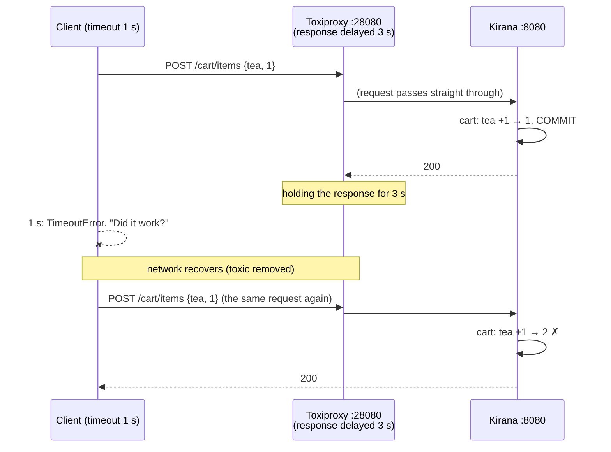

# Stage 7: Idempotency — implementation log

One section per step: what was built, which problem it solves, the new code, and how a
request flows through it. Diagrams are Mermaid (GitHub renders them).

---

## 0. Where Stage 7 starts

**Idempotency** is a property: doing something twice has the same effect as doing it once. An
**idempotency key** is one way to get it: the caller makes up a unique id for one intended
action, sends it with every attempt, and the server stores "key → result" and replays the
result for a repeat.

After Stage 6, Kirana has the property almost everywhere *inside*:

| Where | Mechanism | Identity used |
|---|---|---|
| Razorpay order per Kirana order | stored and reused (D55) | our order id |
| verify payment | conditional `UPDATE … WHERE status='CREATED'` | order id |
| webhooks | outbox `event_id` derived from the gateway's event id (unique) | gateway event id |
| Kafka consumers | `processed_events` + conditional updates | event id |
| refunds | `payment_id UNIQUE`, lease, ask first | payment id |
| warehouse | `Idempotency-Key: kirana-order-{id}` (a real key, sent by us) | order id |

The gap is the **edge**: Kirana's own API. A client's retry carries no identity. Two
`POST /cart/items {tea, 1}` look the same whether they are a retry (add 1 in total) or a second
tap (add 2). Only the client knows, and an idempotency key is how it says so.

Plan and decisions: `CLAUDE.md` (Stage 7 plan), D69: the key is **required** on
`POST /cart/items`, `POST /orders`, `POST /orders/{id}/payment`, `POST /orders/{id}/cancel`,
and every client is updated.

---

## 7a. Reproducing the problem

**Done:** a script, `infra/perf/duplicate_demo.py`, and a Toxiproxy route in front of the
backend's API (`localhost:28080` → `:8080`), so a client can lose a **response**.

**Why a lost response, not a lost request:** if the request is lost, nothing happened and a
retry is harmless. The dangerous case is the server doing the work and the answer never
arriving: a slow mobile network, a load balancer timeout, a client with a short timeout. The
client can't tell which happened, so it retries.



### Result (real stack)

```
1. Add 1 tea to the cart; the response is lost; the client retries
   client saw: no response (TimeoutError), then 200
   server: cart has 2 tea  <-- wanted 1
2. Place the order; the response is lost; the client retries
   client saw: no response (TimeoutError), then 409 Cart is empty
   server: 1 order(s) exist: [50051202]; the client does NOT know its order id
3. Pay now on that order; the response is lost; the client retries
   client saw: no response (TimeoutError), then 200 (gateway order order_NPBHpw88mdwbIQ)
   (already safe without a key: D55 reuses the order's one gateway order)
4. Cancel it; the response is lost; the client retries
   client saw: no response (TimeoutError), then 409 Order not awaiting payment: Order 50051202 is CANCELLED
   server: order 50051202 is CANCELLED  <-- the cancel worked, but the client was told it failed
```

| # | Endpoint | Kind of failure | Why |
|---|---|---|---|
| P2 | add to cart | **wrong data**: a duplicate effect | the operation is "increment", which isn't idempotent |
| P1 | place order | **wrong answer**: no duplicate (the empty cart stopped it), but the client lost its order | the second request is judged on today's state, not recognised as a repeat |
| — | pay now | none | naturally idempotent since D55 |
| P3 | cancel | **wrong answer**: told "failed" although it worked | same as P1 |

Two different problems, one fix. A key stops the duplicate effect (P2) *and* lets the server
return the first answer (P1, P3). Pay now is already safe; it gets a key anyway for one uniform
rule (D69).

### New code

| File | What |
|---|---|
| `infra/toxiproxy/toxiproxy.json`, `infra/docker-compose.yml` | proxy `kirana-api`: `28080` → `host.docker.internal:8080` |
| `infra/perf/duplicate_demo.py` | four scenarios: delay the response 3 s (client gives up after 1 s), retry, check what the server did; `--keys` (from 7c) sends one key per action |

### Try it

`docker compose up -d toxiproxy` (picks up the new route), backend on 8080, then
`python3 infra/perf/duplicate_demo.py`. After 7b this run gets 400s (no key); after 7c,
`--keys` shows every scenario fixed.
