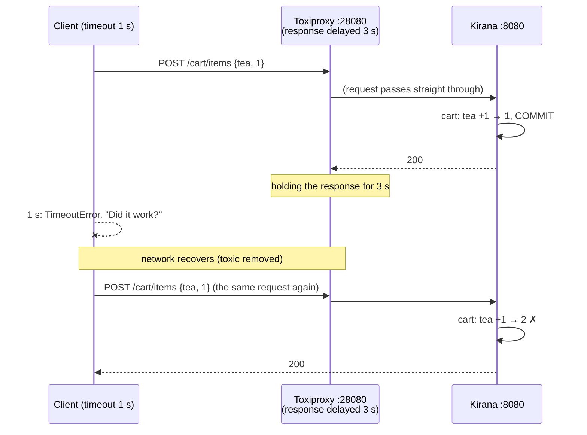
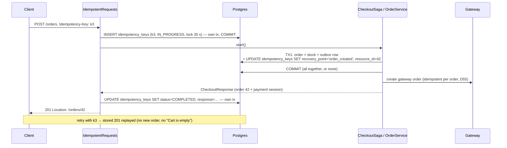
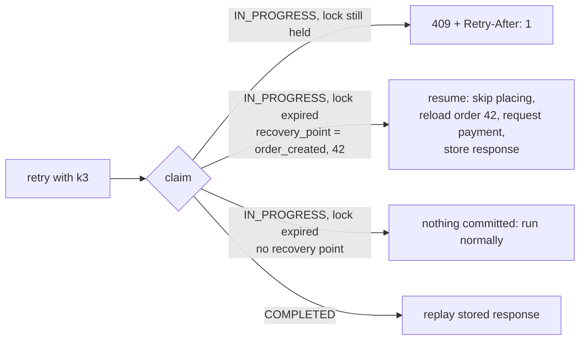
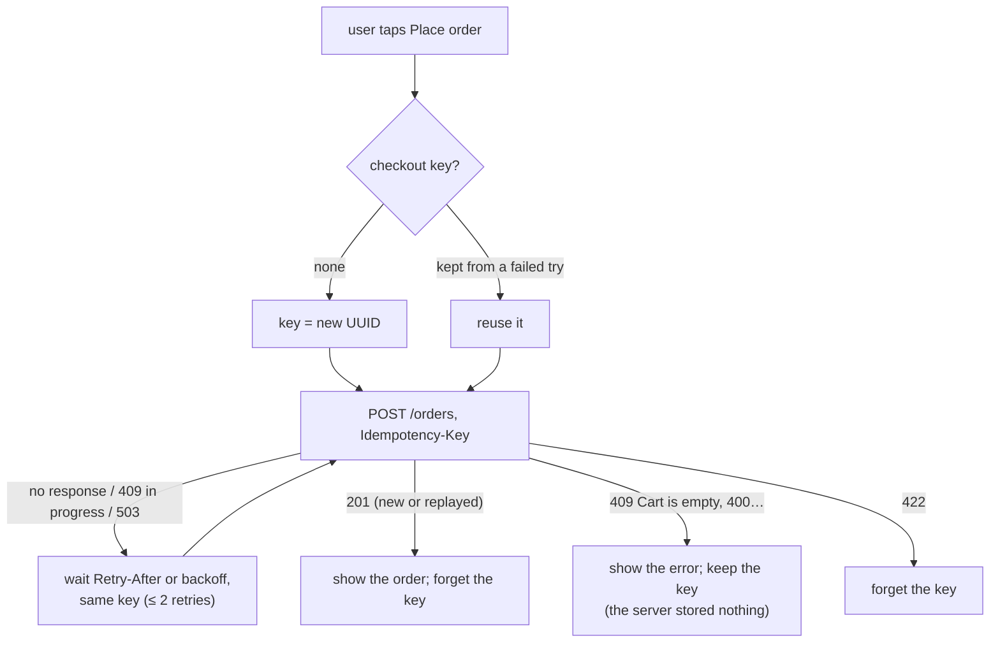
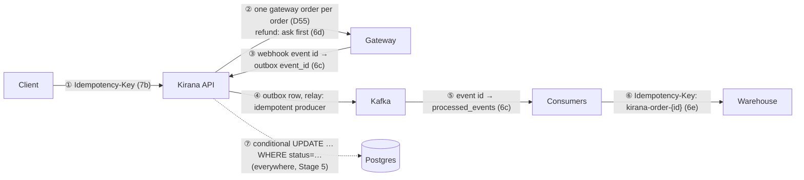

# Stage 7: Idempotency — implementation log

One section per step: what was built, which problem it solves, the new code, and how a
request flows through it. Diagrams are Mermaid (GitHub renders them).

---

## 0. Where Stage 7 starts

**Idempotency** is a property: doing something twice has the same effect as doing it once. An
**idempotency key** is one way to get it: the caller makes up a unique id for one intended
action, sends it with every attempt, and the server stores "key → result" and replays the
result for a repeat.

After Stage 6, Kirana has the property almost everywhere *inside*:

| Where | Mechanism | Identity used |
|---|---|---|
| Razorpay order per Kirana order | stored and reused (D55) | our order id |
| verify payment | conditional `UPDATE … WHERE status='CREATED'` | order id |
| webhooks | outbox `event_id` derived from the gateway's event id (unique) | gateway event id |
| Kafka consumers | `processed_events` + conditional updates | event id |
| refunds | `payment_id UNIQUE`, lease, ask first | payment id |
| warehouse | `Idempotency-Key: kirana-order-{id}` (a real key, sent by us) | order id |

The gap is the **edge**: Kirana's own API. A client's retry carries no identity. Two
`POST /cart/items {tea, 1}` look the same whether they are a retry (add 1 in total) or a second
tap (add 2). Only the client knows, and an idempotency key is how it says so.

Plan and decisions: `CLAUDE.md` (Stage 7 plan), D69: the key is **required** on
`POST /cart/items`, `POST /orders`, `POST /orders/{id}/payment`, `POST /orders/{id}/cancel`,
and every client is updated.

---

## 7a. Reproducing the problem

**Done:** a script, `infra/perf/duplicate_demo.py`, and a Toxiproxy route in front of the
backend's API (`localhost:28080` → `:8080`), so a client can lose a **response**.

**Why a lost response, not a lost request:** if the request is lost, nothing happened and a
retry is harmless. The dangerous case is the server doing the work and the answer never
arriving: a slow mobile network, a load balancer timeout, a client with a short timeout. The
client can't tell which happened, so it retries.



### Result (real stack)

```
1. Add 1 tea to the cart; the response is lost; the client retries
   client saw: no response (TimeoutError), then 200
   server: cart has 2 tea  <-- wanted 1
2. Place the order; the response is lost; the client retries
   client saw: no response (TimeoutError), then 409 Cart is empty
   server: 1 order(s) exist: [50051202]; the client does NOT know its order id
3. Pay now on that order; the response is lost; the client retries
   client saw: no response (TimeoutError), then 200 (gateway order order_NPBHpw88mdwbIQ)
   (already safe without a key: D55 reuses the order's one gateway order)
4. Cancel it; the response is lost; the client retries
   client saw: no response (TimeoutError), then 409 Order not awaiting payment: Order 50051202 is CANCELLED
   server: order 50051202 is CANCELLED  <-- the cancel worked, but the client was told it failed
```

| # | Endpoint | Kind of failure | Why |
|---|---|---|---|
| P2 | add to cart | **wrong data**: a duplicate effect | the operation is "increment", which isn't idempotent |
| P1 | place order | **wrong answer**: no duplicate (the empty cart stopped it), but the client lost its order | the second request is judged on today's state, not recognised as a repeat |
| — | pay now | none | naturally idempotent since D55 |
| P3 | cancel | **wrong answer**: told "failed" although it worked | same as P1 |

Two different problems, one fix. A key stops the duplicate effect (P2) *and* lets the server
return the first answer (P1, P3). Pay now is already safe; it gets a key anyway for one uniform
rule (D69).

### New code

| File | What |
|---|---|
| `infra/toxiproxy/toxiproxy.json`, `infra/docker-compose.yml` | proxy `kirana-api`: `28080` → `host.docker.internal:8080` |
| `infra/perf/duplicate_demo.py` | four scenarios: delay the response 3 s (client gives up after 1 s), retry, check what the server did; sends one key per action (`--no-keys`: none, as before Stage 7) |

### Try it

`docker compose up -d toxiproxy` (picks up the new route), backend on 8080, then
`python3 infra/perf/duplicate_demo.py --no-keys` (the output above, on a pre-Stage-7 backend; since
7b it gets 400s). Without `--no-keys` it sends a key per action and every scenario is fixed (7b).

---

## 7b. Idempotency keys in Postgres

**Done:** the four mutating shopper endpoints require an `Idempotency-Key` header and run each
key at most once. The rules follow the IETF draft *The Idempotency-Key HTTP Header Field*
(the same rules Stripe, Adyen and PayPal use):

| Situation | Answer |
|---|---|
| no key | **400** `errors: [{field: "Idempotency-Key", …}]` |
| new key | run it; store the response with the key |
| key seen, that request **finished** | **replay** the stored status, body and `Location`; header `Idempotent-Replayed: true` |
| key seen, that request **still running** | **409** "Request in progress" + `Retry-After: 1` |
| key seen, **different** request (endpoint or body) | **422** "Idempotency-Key reused" |
| key seen, its attempt **died** (lock expired) | run again, **resuming after its last recovery point** |

Keys are per shopper (`user_id` + key), kept 24 h, then deleted hourly.

### The hard part: "save the key" and "do the work" must agree

The obvious version is: claim the key, do the work, store the response. It has a hole:

| Crash between… | Naive result |
|---|---|
| doing the work and storing the response | the key says "in progress" but the work happened. When the lock expires, a retry does it **again**: the duplicate we set out to prevent |

The fix is **recovery points**, the technique Stripe described for its own API: each step that
changes something writes "I got here" onto the key row **in the same transaction as the change**.



And if the process dies after TX1:



| Endpoint | Recovery point (same transaction as) | Resume does |
|---|---|---|
| `POST /cart/items` | `cart_updated` (the increment) | return the cart, don't add again |
| `POST /orders` | `order_created` + order id (TX1: order, stock, outbox) | continue with that order: payment session, response |
| `POST /orders/{id}/cancel` | `order_closed` + order id (the close + stock release) | return the order |
| `POST /orders/{id}/payment` | none needed: already idempotent (D55) | run again |

Failures: only successful responses are stored. A failed attempt that committed nothing (cart
empty, out of stock, checkout busy) **deletes** its claim, so a retry with the same key runs again
against current state. One that committed part of its work keeps the key and is unlocked, so the
retry resumes at once.

### New and changed code

| File | What |
|---|---|
| `db/migration/V9__idempotency_keys.sql` | `idempotency_keys`: PK (user, key), endpoint, request hash (SHA-256 of endpoint + body), status, recovery point + resource id, lock, stored status/body/Location |
| `idempotency/IdempotentRequests.java` | the rules above; called by controllers; replays raw stored JSON |
| `idempotency/IdempotencyStore.java`, `PostgresIdempotencyStore.java` | claim (`INSERT … ON CONFLICT DO NOTHING`, else `SELECT … FOR UPDATE` and decide), `reach` (joins the caller's transaction), complete, fail; claim/complete/fail in their own `REQUIRES_NEW` transactions |
| `idempotency/IdempotencyContext.java` | the current request's key on this thread, for services: `past(point)` to resume, `reach(point, id)` to mark; no-op for jobs and consumers |
| `idempotency/IdempotencyCleanup.java` | hourly delete of keys older than 24 h |
| `CartController`, `OrderController` | header on the four endpoints; replays skip the checkout bulkhead |
| `CartService.add`, `OrderService.placeInDb`, `CheckoutSaga.start/cancel/close` | recovery points and resumes |
| `GlobalExceptionHandler` | 409 + `Retry-After`, 422 |
| `application.yml` | `kirana.idempotency.store` (postgres), `lock-timeout: 30s`, `retention: 24h` |
| Tests | `IdempotencyIntegrationTest` (11): no key 400; retried add adds once with the same body; different body 422; keys per shopper; retried order → same order; retried cancel → 200; 4 simultaneous → 1 order (others 409); failed attempt forgotten; **died after placing → resumed, not repeated**; **died after the increment → not incremented again**; cleanup. Existing HTTP tests now send keys; the flash-sale "refused at the gate" request costs 3 statements, not 1 (claim + release). **106 tests pass.** |

### Result (real stack, `duplicate_demo.py`)

```
no key:   400 Validation failed (Idempotency-Key)
with keys:
1. Add 1 tea:   TimeoutError, then 200  → cart has 1 tea  ok
2. Place order: TimeoutError, then 201  → 1 order; the client knows its order: #50051252
3. Pay now:     TimeoutError, then 200  (same gateway order)
4. Cancel:      TimeoutError, then 200  → CANCELLED  ok
log: Idempotency-Key 13b4f4ff-… (user 2505903): POST /orders already done, stored 201 replayed
```

### Costs

* Two extra statements per request (claim, complete), three on a refused one.
* The stored response is the one from the first attempt: a replay doesn't show later changes
  (that is the point; `GET` the resource for current state).
* Services know about recovery points (one line each). The alternative, a generic filter that
  can't see transactions, can't close the crash window.

---

## 7c. Every client sends keys

**Done:** all callers of the four endpoints send an `Idempotency-Key`; there is no compatibility
mode (D69). The frontend behaves like a payment SDK (D70).

### The client side of the contract

| Rule | Why |
|---|---|
| **a new key per user action** (a tap of "Add", one checkout attempt) | a second tap is a new intent: it must not be swallowed as a repeat |
| **the same key for every retry of that action** | that's how the server recognises a repeat |
| **retry only when the outcome is unknown**: no response, 409 "Request in progress", 502/503/504 | a definite answer (200, 400, 409 "Cart is empty") is the answer; retrying it changes nothing |
| wait `Retry-After`, else 0.4 s, 0.8 s + jitter; at most 2 retries | don't hammer a struggling server, don't retry in lockstep |
| keep the key until the action **succeeds** | a user clicking "Place order" again after a timeout repeats the same action and gets its order |
| drop the key on 422 | it belonged to a different request |



### New and changed code

| File | What |
|---|---|
| `frontend/src/api.js` | `newKey()`; `request()` retries on unknown outcomes with the same key (backoff, `Retry-After`); `cart.add`, `orders.place/pay/cancel`, `rush.*` take or make a key; every attempt is logged with its key, attempt number and `replayed` |
| `frontend/src/pages/Cart.jsx` | one key per checkout attempt, kept until the order is placed |
| `frontend/src/pages/Orders.jsx` | one key per (pay / cancel, order), kept until that succeeds |
| `frontend/src/components/Inspector.jsx` | Requests panel: `key · retry 1 · replayed` on the row; the key and what "replayed" means in the detail |
| `infra/perf/resilience_demo.py` | keys on cart adds, checkouts, cancels |
| `infra/perf/duplicate_demo.py` | keys by default; `--no-keys` for the old behaviour (400 now) |
| backend tests | every HTTP test of these endpoints sends a key (7b) |
| `docs/api-contract.md` | the header, its rules (★ on the four endpoints), when to retry |

The AI assistant's plan (`kirana-ai/docs/AI-PLAN.md`, phase P6) already specified
`Idempotency-Key` for its cancel and cart writes; its code doesn't call these endpoints yet.

### Checked

The real `api.js`, run in Node against a scripted network:

```
1. lost then replay ->  {"order":{"id":42}}  keys sent: key-A, key-A
2. definite 409 ->      409 Cart is empty | attempts: 1
3. in progress then ok -> attempts: 2, same key: true, waited ~1 s (Retry-After)
4. two taps ->          different keys: true
```

### Try it

Restart the backend (V9) and reload the frontend. Add to cart and place an order: the Requests
panel shows `key` on each POST. To see a retry, pause the backend for a moment while placing an
order (Ctrl+Z in its terminal, then `fg` within a few seconds): the panel shows `retry 1`, and if
the first attempt had got through, `replayed`.

---

## 7d. The same keys in Redis, for comparison

**Done:** a second store behind `kirana.idempotency.store=redis` (env `IDEMPOTENCY_STORE`):
one hash per key (`idem:{user}:{key}`, 24 h TTL); claim is one Lua script so check-and-claim
is atomic. Measured against Postgres, then broken on purpose.

### Speed (real stack, 300 sequential requests each, `infra/perf/idempotency_bench.py`)

| Store | New key p50 / p95 | Replay p50 / p95 | SQL statements (new / replay) |
|---|---|---|---|
| Postgres | 5.68 / 8.87 ms | 1.40 / 1.76 ms | 10 / 2 |
| Redis | 5.71 / 9.80 ms | 1.51 / 2.36 ms | 7 / 0 |

**No difference worth having.** Redis removes three SQL statements but adds the same number of
Redis round trips; on one machine both cost well under a millisecond. Redis would pay off when
the database is the bottleneck under load (fewer statements, fewer connections held), not for
latency. (A first run showed only 30/300 successful replays: the cart rate limit, 20 writes per
10 s per shopper, was refusing them. Spread over 150 shoppers, all succeed.)

### Where Redis falls short

| Failure | Postgres store | Redis store | Seen |
|---|---|---|---|
| **Crash after the work commits, before the key records it** | impossible: the recovery point is in the same transaction | the recovery point is written *after* the commit; a crash in between loses it and the retry **repeats the work** | by construction (diagram below) |
| **Redis restarts or evicts** (no persistence, `allkeys-lru`, Stage 4) | n/a | the key is forgotten; a retry **runs again** | add k1 → retry k1 → key deleted → retry k1: **cart = 2** |
| **Redis down** | unaffected (Redis only bypassed: cache, rate limits) | every protected request **503** (fail closed) | Redis paused: Redis store **503**; Postgres store **200, replayed once** |

```mermaid
sequenceDiagram
    participant S as CartService
    participant DB as Postgres
    participant R as Redis
    rect rgb(235, 245, 235)
    Note over S,DB: Postgres store
    S->>DB: BEGIN; cart +1; UPDATE idempotency_keys SET recovery_point='cart_updated'; COMMIT
    Note over S,DB: both or neither
    end
    rect rgb(250, 235, 235)
    Note over S,R: Redis store
    S->>DB: BEGIN; cart +1; COMMIT
    Note over S: 💥 crash here: Redis never hears 'cart_updated'
    S--xR: HSET recovery_point cart_updated (afterCommit)
    Note over R: retry after the lock expires → no recovery point → adds again
    end
```

Writing the recovery point to Redis *before* the commit would be worse: if the transaction then
rolled back, the key would claim work that never happened, and the retry would skip it.

**Fail closed, on purpose.** The Stage 4 cache fails *open* (Redis down → ask Postgres): serving
from the source of truth is always correct. An idempotency check that fails open would run
requests unprotected, which is exactly the duplicate it exists to stop. So the Redis store
refuses (503 + `Retry-After: 5`) and Kirana's cart and checkout now depend on Redis being up.

**Conclusion (D71):** Postgres stays the store. The keys protect writes to Postgres, so they
belong in Postgres: same transaction, same durability, same availability, and no new
dependency. Redis-based keys fit when the protected work isn't in a database you can share a
transaction with, or as a fast first filter in front of a durable check.

### New code

| File | What |
|---|---|
| `idempotency/RedisIdempotencyStore.java` | Lua claim (new / mismatch / completed / in progress / takeover), recovery point after commit, complete, Lua fail; every call through the Stage 5 Redis breaker; Redis errors → 503 |
| `idempotency/IdempotencyUnavailableException.java`, `GlobalExceptionHandler` | 503 "Idempotency unavailable", `Retry-After: 5` |
| `infra/perf/idempotency_bench.py`, `docs/perf/stage7-{postgres,redis}.json` | the measurement |
| Tests | `RedisIdempotencyIntegrationTest`: replay from Redis with a TTL, 422, recovery point resumed, **a forgotten key repeats the add**; `RedisDownIdempotencyIntegrationTest`: Redis down → 503, nothing added. **110 tests pass.** |

### Try it

`python3 infra/perf/idempotency_bench.py --label postgres`; restart the backend with
`IDEMPOTENCY_STORE=redis`, run it with `--label redis`; then `docker pause kirana-redis-1` and add
something to the cart (503), `docker unpause kirana-redis-1`. Restart without the variable to go
back to Postgres.

---

## 7e. The whole picture: one idea, seven places

Every arrow in Kirana that can deliver something twice now has an answer. They are all the same
idea: **give the action an identity, and make the effect happen at most once per identity**.
Only the source of the identity differs.



| # | Duplicate comes from | Identity | Where it's remembered | Effect at most once because |
|---|---|---|---|---|
| ① | a client retry | `Idempotency-Key` (client-made) | `idempotency_keys` | claim + recovery points in the work's transaction |
| ② | our retry to the gateway | our order id / payment id | `orders.gateway_order_id`, `refunds.payment_id UNIQUE` | reuse the stored id; ask before refunding |
| ③ | the gateway's webhook retry | gateway event id | `outbox.event_id UNIQUE` | the second insert is rejected |
| ④ | the producer's network retry | producer id + sequence number | the broker | Kafka's idempotent producer drops the repeat |
| ⑤ | Kafka redelivery (at-least-once) | event id | `processed_events` | inbox row in the same transaction as the work |
| ⑥ | our retry to the warehouse | `kirana-order-{id}` (server-made) | the warehouse | it replays the first shipment |
| ⑦ | any of the above reaching the state | the row's current status | the row | `UPDATE … WHERE status = 'CREATED'`: only one caller gets 1 row |

### Kafka's own "idempotence" and "exactly once": what they cover

* **Idempotent producer** (`enable.idempotence: true`, on since 6a). The broker numbers each
  producer's records per partition and drops a re-sent batch it already has. It covers the
  network between *one producer session* and the broker. It does **not** cover the relay sending
  an outbox row, crashing before marking it published, and sending it again after restart: that's
  a new send, so consumers still need ⑤.
* **Transactions / exactly-once semantics.** A Kafka transaction makes "consume from topic A,
  produce to topic B, commit A's offset" atomic, *inside Kafka*. Kirana's consumers don't produce
  to Kafka as their effect; they write Postgres and call a gateway or a warehouse, which Kafka's
  transaction can't include. So Kirana uses the general rule:

  > **exactly-once *effect* = at-least-once *delivery* + an idempotent effect.**

  That's why every consumer was built idempotent instead of reaching for Kafka transactions.

### Which endpoints need a key, and which don't

| Endpoint | Naturally idempotent? | Key |
|---|---|---|
| `GET` anything | yes (reads) | no |
| `PUT /cart/items/{id}` (set quantity), `DELETE /cart/items/{id}` | yes: "set to 3", "remove": same result twice | no |
| `POST /orders/{id}/payment/verify` | yes: conditional update, a repeat answers "PAID" | no |
| `POST /cart/items` (add) | **no**: "add 1" twice is 2 | **required** |
| `POST /orders` | **no**: creates | **required** |
| `POST /orders/{id}/cancel` | effect yes, **answer no** (second gets 409) | **required** |
| `POST /orders/{id}/payment` | yes (D55) | required anyway: one rule for every mutating shopper POST (D69) |

### Limits of idempotency keys

| Limit | What it means here |
|---|---|
| **Retention** | after 24 h a key is forgotten; a retry after that runs as new. Clients don't retry that late. |
| **Scope** | per shopper; the same key from two shoppers is two keys. Per request: endpoint + body hash, so `{"quantity":1}` and `{"quantity": 1}` are the same (re-serialised), but a new field is a different request (422). |
| **A snapshot, not live state** | the replay is the *first* response; the order may have been paid since. `GET` it for current state. |
| **Only as good as the client** | a client that makes a new key per retry gets no protection; one that reuses a key for a new action gets the old answer (or 422). |
| **Not a lock between different actions** | two taps = two keys = two adds, by design. Stopping accidental double taps is the UI's job (disable the button). |
| **Storage** | each key stores its response body (an order with its lines). Bounded by retention and cleanup. |
| **Only at the edge** | downstream steps use server-made identities (order id, payment id, event id), never the client's key. |

### What Stage 7 leaves open (for the next stages)

| Problem | Stage |
|---|---|
| Every instance runs every job (reconcile, expiry, re-check, refund retries, outbox and key cleanup): correct thanks to conditional updates and leases, but duplicated work and gateway calls; stale `PENDING` images never cleaned | **8** (distributed locking) |
| **Outbox ordering across instances** (found reviewing `docs/flows.md`): with two relays, `FOR UPDATE SKIP LOCKED` lets relay B publish row 120 while relay A is still sending row 99. If both belong to one order, Kafka gets them out of order. One relay at a time (a lock or leader) or an outbox split by key fixes it | **8** |
| Consumers live in the checkout process; mixed versions in one group (6d) | 9 |
| One broker, in-memory mocks | 10–11 |
| No metrics or alerts (lag, dead letters, failed refunds, 409 "in progress" rate) | 14 |

---

## Seeing it all: `infra/perf/idempotency_tour.py`

One script runs every rule against the backend on :8080 and prints the `idempotency_keys` row
after each step: no key (400), stored and replayed, different body (422), **409 in progress**
(made reproducible by slowing payment-mock so the first attempt is still running), Pay now
replay, a webhook delivered twice (one outbox row), and cancel replayed vs a new key (409).
